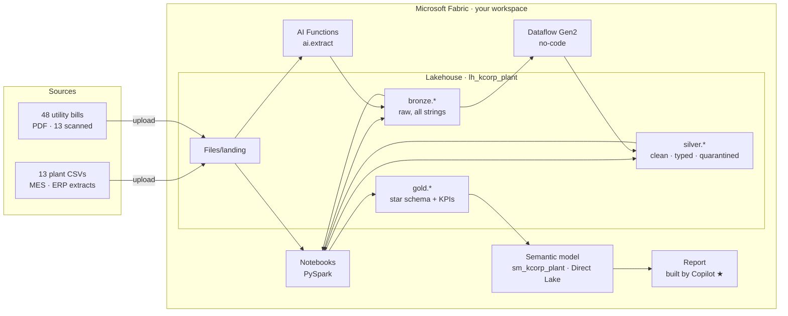

# Astar × Microsoft Fabric: Hands-on Workshop
## From plant floor to Power BI: land, refine and model manufacturing data in one afternoon

You are the data team at **K-Corp**, a fictional electronics manufacturer with four plants:
**SG-01** Singapore, **MY-01** Malaysia, **IN-01** India and **AU-01** Australia. The plant-operations director wants
**one trusted view** of production, quality, maintenance, customer orders *and* utility costs. Today that data is
scattered:

- **MES / ERP extracts**: 13 CSV files. They're messy, the way real extracts are: duplicates, impossible dates,
  free-text spellings, mixed date formats.
- **Utility bills**: 48 PDFs from four providers in four layouts. 13 of them are scans with no text at all.

In a series of bite-sized labs you'll bring it all into **Microsoft Fabric**. You land it in a **Lakehouse**, refine
it through the **medallion architecture** (Bronze → Silver → Gold) with notebooks and a no-code **Dataflow Gen2**, turn
the PDFs into rows with **AI Functions**, and finish with a **Direct Lake semantic model** that Power BI and Copilot
can use.

> **Audience:** engineers and analysts new to Microsoft Fabric. No prior Spark or Power BI experience needed: every
> step has a screenshot, and every notebook explains itself cell by cell.

---

### The labs

| # | Lab | You'll use | ⏱ |
|---|---|---|---|
| 0 | [Setup: workspace and kit](lab00-setup/README.md) | Fabric portal | 10 min |
| 1 | [Land the data in a Lakehouse](lab01-land-data/README.md) | Lakehouse · file upload | 20 min |
| 2 | [Bronze: raw files to Delta tables](lab02-bronze/README.md) | Notebook | 15 min |
| 3 | [Silver: clean the facts in code](lab03-silver-notebook/README.md) | Notebook | 25 min |
| 4 | [Silver: clean the dimensions without code](lab04-silver-dataflow/README.md) | Dataflow Gen2 | 20 min |
| 5 | [Gold: build the star schema](lab05-gold/README.md) | Notebook | 20 min |
| 6 | [Unstructured data: PDFs to rows with AI](lab06-unstructured-ai/README.md) | Notebook · AI Functions | 30 min |
| 7 | [Semantic model](lab07-semantic-model/README.md) | Direct Lake · Copilot | 25 min |
| ★ | [Stretch: let Copilot build the report](lab08-stretch-report/README.md) | Power BI · Copilot | optional |

Each lab ends with a **✅ checkpoint**, and each notebook ends with a **verify** cell that prints ✅ or ❌ against
the known-correct row counts. The data is fixed, so everyone should see the same numbers (see
[expected results](docs/facilitator/expected-results.md)).

**Fell behind?** The three labs most likely to overrun have a catch-up path, so you can still start the next lab:
- Lab 4 → [`04_silver_dims_catchup`](lab04-silver-dataflow/notebooks/04_silver_dims_catchup.ipynb) builds the three dimensions in code.
- Lab 6 → set `USE_CATCHUP = True` to load pre-extracted bill data.
- Lab 7 → [`07_semantic_model_catchup`](lab07-semantic-model/notebooks/07_semantic_model_catchup.ipynb) adds any missing relationships and measures.

### Agenda (1 October, 14:00–17:00)

| Time | Session |
|---|---|
| 14:00 | Welcome · Fabric in 10 minutes · **Lab 0** |
| 14:15 | **Lab 1** Land the data |
| 14:35 | **Lab 2** Bronze |
| 14:50 | **Lab 3** Silver (notebook) |
| 15:15 | **Lab 4** Silver (Dataflow Gen2) |
| 15:35 | ☕ Break |
| 15:45 | **Lab 5** Gold |
| 16:05 | **Lab 6** Unstructured data with AI |
| 16:35 | **Lab 7** Semantic model |
| 16:55 | Wrap-up · ★ stretch lab to take home |

### Get the kit

Click the green **`< > Code`** button on this page → **Download ZIP**, then unzip it. You'll upload files from the
`data/landing/` folder in Lab 1, and import notebooks from each `labNN-*/notebooks/` folder as you go.

| Folder | What's inside |
|---|---|
| `data/landing/plant/` | 13 CSV files: 8 dimensions, 5 facts (about 12k rows) |
| `data/landing/utility_bills/` | 48 PDF bills, `2026-01` … `2026-06` |
| `data/landing/reference/` | Ground truth for scoring the AI, plus a catch-up extraction |
| `labNN-*/` | One folder per lab: a `README.md` guide and its notebook(s) |
| `docs/facilitator/` | Pre-flight checklist, run of show, expected results, troubleshooting |
| `docs/media/` | [Short screen recordings](docs/media/README.md) of key steps from the golden run |

### Names used throughout

Use these names exactly; the notebooks and guides refer to them.

| Item | Name |
|---|---|
| Lakehouse (with **schemas** enabled) | `lh_kcorp_plant` |
| Folder for raw files | `Files/landing/` |
| Schemas | `bronze`, `silver`, `gold` |
| Dataflow Gen2 | `df_silver_dimensions` |
| Semantic model | `sm_kcorp_plant` |

> **About the screenshots:** they were taken in a demo tenant, so workspace names, user names and the colour of
> your avatar will differ. Fabric's UI also changes often; if a button has moved, look for the same label nearby,
> or behind a **⋯** menu.

### Data

All data is **synthetic**. K-Corp, its plants, customers, utility providers and every bill are fictional. The
plant data comes from the K-Corp demo estate, with a documented set of data-quality problems deliberately added
(see [expected results](docs/facilitator/expected-results.md#what-was-seeded)). The utility bills were generated
from the plants' own production volumes, so *energy per unit produced* is a meaningful number.

*This workshop adapts the structure of Lab 1 of the
[Resident 360 data workshop](https://github.com/stellistic/resident-360-data-workshop) to a manufacturing
scenario.*
