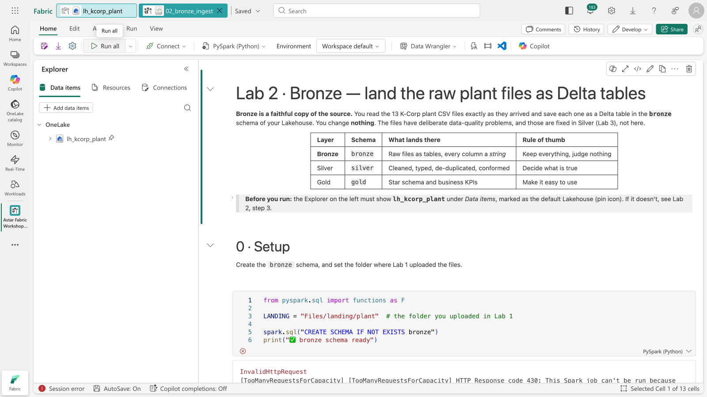
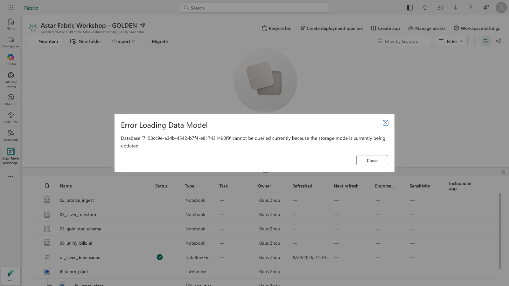
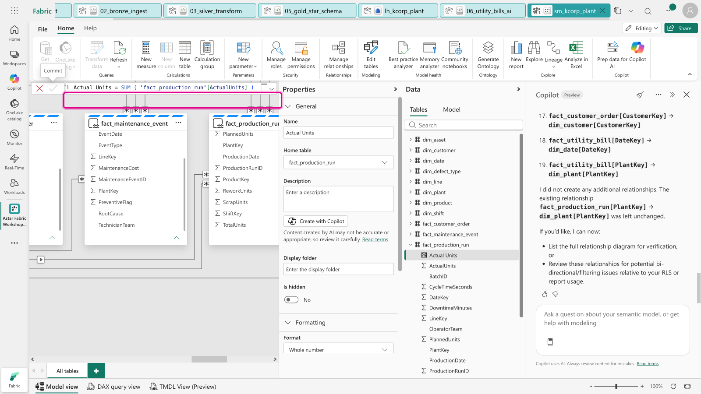

[← Workshop home](../../README.md)

# Troubleshooting

Problems seen in the golden run and dry runs, with the fix for each. Search this page for the error text.

## Lab 1 · Upload

**No "Upload" on the folder's ⋯ menu.**
Fabric moved it: **click the folder to open it**, then use **Get data → Upload files** in the folder view (or on
the ribbon). The ⋯ menu only offers *New subfolder*, *Rename* and so on.

**The Upload pane doesn't take a folder.**
Correct: it takes files. That's why the kit keeps each folder flat. Open the matching Lakehouse folder first, then
select all the files inside the kit folder (Ctrl+A / ⌘A).

**Files landed in the wrong folder.**
The destination is the folder you had open. Select the misplaced files in the file list → **⋯ → Move to** (or
delete them) and upload again from the right folder.

## Labs 2–6 · Notebooks

### `TooManyRequestsForCapacity … HTTP Response code 430`

The shared capacity has no Spark cores free for a new session. Interactive notebooks aren't queued; they fail
immediately. The golden run hit this on its F2 while a second notebook was already running.

- **Participant:** wait 30–60 seconds and click **Run all** again. Close other notebooks you have open and click
  **■ Stop session** on them.
- **Facilitator:** in **Monitor**, filter *Item type = Notebook, Status = In progress* and cancel stale sessions.
  If it keeps happening, see [capacity sizing](preflight-checklist.md#2--capacity-sizing-spark-concurrency-is-the-constraint).

### `Path does not exist: …/Files/landing/plant/…` or "Found 0 CSV files"
The files aren't where the notebook expects them. Check the Lakehouse has exactly `Files/landing/plant`
(lower case) with 13 files. See the Lab 1 checkpoint.

### `[TABLE_OR_VIEW_NOT_FOUND] … bronze.…` in Lab 3 (or `silver.…` in Lab 5)
The previous lab didn't finish, or this notebook is attached to a **different** Lakehouse. Check the Explorer
shows `lh_kcorp_plant` with the 📌 pin. In Lab 5, the missing table is usually `dim_product`, `dim_customer` or
`dim_plant`: finish Lab 4 or run its catch-up notebook.

### The notebook can't write: `permission`, `403` or `read-only`
You attached the **SQL analytics endpoint** instead of the Lakehouse. In the Explorer, hover the item → **⋯ →
Remove**, then *Add data items → From OneLake catalog* and tick the row with the **house-and-wave** icon.

### A verify cell shows ❌
Every write in the notebooks is an *overwrite*, so re-running is safe. Click **Run all** again from the top. If
Lab 3's numbers are off, check that Lab 2's verify cell was all ✅ first.

### Lab 6 · `ai.extract` fails
- *"…not enabled…"*, *"…Copilot…"*, `401`/`403`: the tenant or capacity doesn't allow AI Functions (a trial capacity,
  or the Azure OpenAI tenant switch is off). Set `USE_CATCHUP = True` and carry on; tell the facilitator.
- *`ModuleNotFoundError: synapse.ml.aifunc`*: the workspace uses a custom environment older than Runtime 1.3.
  Switch to *Workspace default*, or Runtime 1.3/2.0, on the notebook's **Environment** drop-down.
- Some rows come back with `None` for every field: usually throttling on a busy capacity. Re-run the extraction
  cell; only the failed rows need to succeed.

## Lab 4 · Dataflow Gen2

**The destination doesn't show the `silver` schema.**
When choosing the Lakehouse destination, you must connect with **Navigate using full hierarchy** turned on (under
*Advanced options*), otherwise schemas are hidden and the table lands in `dbo`. If you already published to
`dbo`, change the destination and publish again, or simply run the catch-up notebook.

**"Save & run" fails with a staging error.**
Right-click each query → untick **Enable staging** (the lab doesn't need it), then **Save & run** again.

## Lab 7 · Semantic model

**"Error Loading Data Model … storage mode is currently being updated".**

The model opened (in a new tab) before Fabric had finished creating it. Close the message and that tab, wait a
minute, and open `sm_kcorp_plant` from the workspace list. **Don't** press *Confirm* again; that makes a second model.

**"To use special characters in a measure name, enclose the entire name in brackets".**

In the web model editor a measure name with spaces must be written `[Actual Units] = …`, not `Actual Units = …`.

**Copilot says it will make changes but nothing happens.**
Scroll down in the Copilot pane: it's waiting for you to click **Allow** on *"Allow Copilot to make changes during
this chat session?"*.

**A DAX query fails with "Failed to open the MSOLAP connection", or everything errors at once.**
The capacity is **paused** (or throttled). In the golden run's demo tenant, an automation pauses the capacity each night.
Check the capacity state in the Azure portal or the Fabric admin portal and resume it.

**`New semantic model` doesn't list my gold tables.**
The SQL analytics endpoint's metadata lags Spark. On the endpoint's ribbon click **Refresh** (⟳), wait a few
seconds and try again.

**Copilot is greyed out in the model.**
Switch the model from **Viewing** to **Editing** (top-left of the ribbon). The whole ribbon is read-only in
Viewing mode.

**A measure returns blank, or a total looks too big.**
A relationship is missing, inactive, or points the wrong way (1:* instead of *:1). Open **Manage relationships** and
compare with the list in [Prompt 1](../../lab07-semantic-model/assets/copilot-prompts.md#prompt-1--the-remaining-19-relationships)
(plus `fact_production_run[PlantKey] → dim_plant[PlantKey]`), or run [`07_semantic_model_catchup`](../../lab07-semantic-model/notebooks/07_semantic_model_catchup.ipynb),
which adds what's missing, re-activates inactive relationships, resets any measure whose DAX differs from the lab's,
and flags reversed relationships.

**"Creating a semantic model requires a Power BI Pro licence".**
See the [pre-flight licence note](preflight-checklist.md#4--participant-accounts-and-workspaces). The participant
can follow along on a neighbour's screen, or build the model in *My workspace*.

## Lab 9 · Data agent

**No *Data agent* tile in New item.**
The Copilot / Azure OpenAI tenant settings are off, or the workspace isn't on a paid F2+ capacity. For capacities
outside the US/EU, both *processed* and *stored outside your capacity's geographic region* must be on (see the
[pre-flight](preflight-checklist.md)). Changes can take up to an hour.

**The agent's numbers don't match the Lab 7 checkpoint.**
Click **N steps completed** and read the rewritten question and the **DAX**. In the golden run the agent added
"latest full year" by itself, and once read *actual units* as ordered units. Fix it in the model: **Prep data for
AI → Add AI instructions** (see Lab 9, Task D), then **Clear chat** and ask again.

**The agent ignores the instructions I typed in *Agent instructions*.**
That's expected for semantic models: the DAX writer reads only the model's metadata and **Prep data for AI**.
Put business rules there.

**A plant with no name tops a ranking at 100%.**
That's the model's blank row (`1 − blank = 1`). Use a measure that returns blank when there's no data, like Lab 9's
`Yield %`.

**The *Save* icon at the top left opens "Save data agent as".**
That's *Save as* (it makes a copy). Draft changes save automatically; click **Cancel**.
