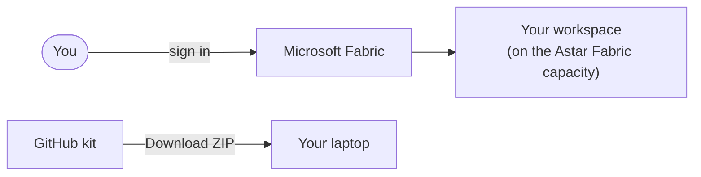
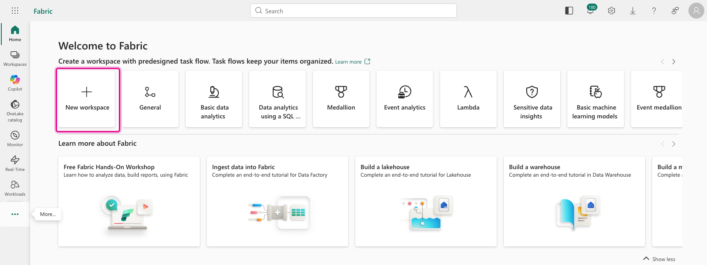
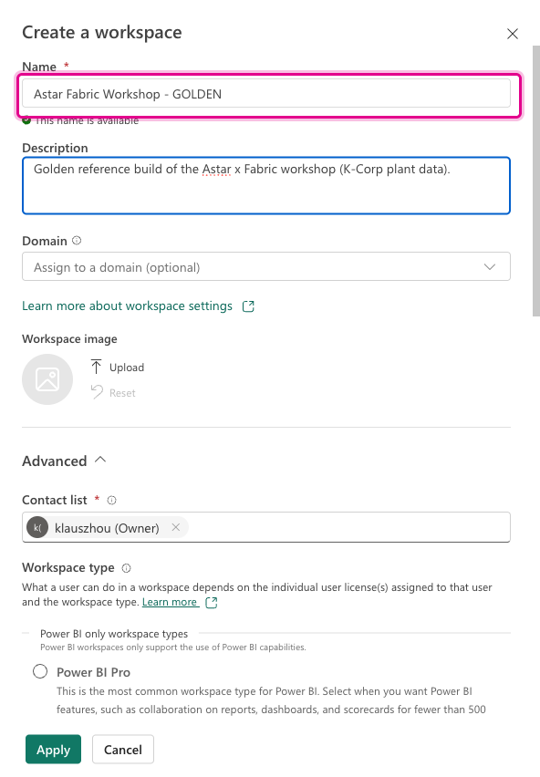
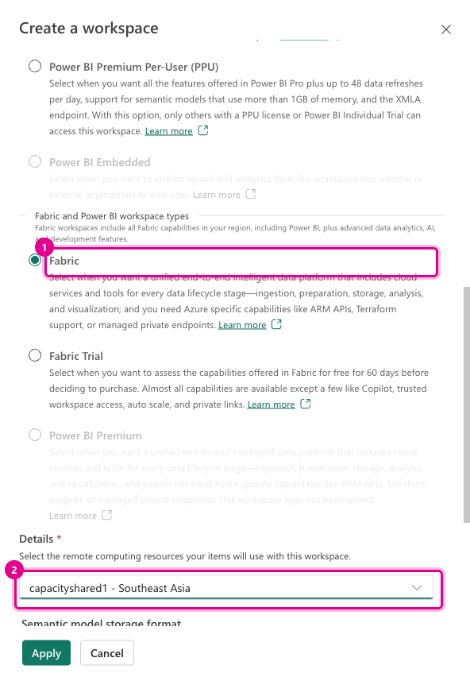
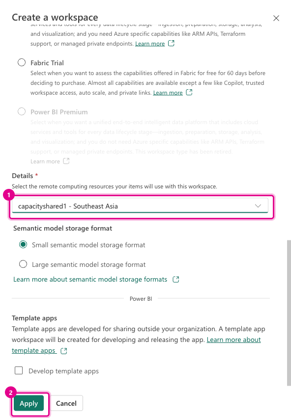
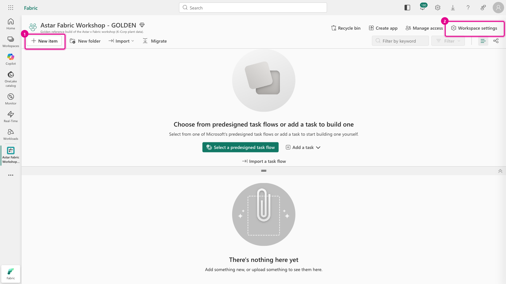
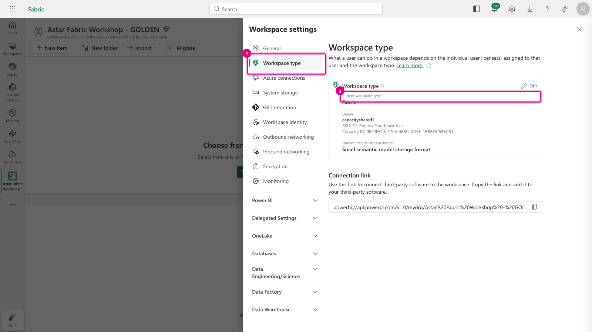

[← Workshop home](../README.md)

# Lab 0 · Setup: your workspace and the kit

**⏱ 10 min** · **🎯 Goal:** a Fabric workspace on a paid capacity, and the workshop kit on your laptop.

### What you'll build

A **workspace** is a container for everything you make in Fabric: lakehouses, notebooks, dataflows, semantic
models and reports. Each workshop participant works in their own workspace, so nobody overwrites anyone else.

> **Already have a workspace?** If your facilitator created one for you, open it (left nav → **Workspaces**),
> check it's on a capacity (step 5), then skip to Task 2.

> ▶ **Watch it:** [creating the workspace](../docs/media/lab00-create-workspace.mp4) (short screen recordings from the golden run)

---

### Task 1: Create your workspace

1. Open **https://app.fabric.microsoft.com** and sign in with your Astar account. On the **Home** page, click
   **New workspace**.

   

2. Give it a name that's unique to you, for example **`Fabric Workshop - <your name>`**, and optionally a
   description.

   

3. Expand **Advanced**. Under **Workspace type**, choose **Fabric**, then pick the workshop capacity from the
   **Details** drop-down. Your facilitator will tell you its name.

   

   > ⚠️ **Don't choose *Fabric Trial* or *Power BI Pro*.** Lab 6 uses **AI Functions**, which need a paid
   > Fabric capacity (F2 or larger). On a trial or Pro workspace, Labs 1–5 and 7 still work, but Lab 6 falls back
   > to its catch-up file.

4. Click **Apply**.

   

5. Your empty workspace opens. Everything in the next labs starts from **+ New item** or **Import** on this
   toolbar.

   

   > **Note:** the first time you open a workspace, a dialog titled **"Introducing task flows"** may cover the
   > page. Click **Got it** to dismiss it. The *task flow* canvas that remains at the top can be ignored.

   **Check the capacity:** click **Workspace settings** → **Workspace type**. It should say **Fabric** and show
   the capacity name and SKU. *(The screenshots were taken on an **F2**, the smallest Fabric SKU; every lab works
   on it.)*

   

### Task 2: Get the kit

1. Open the workshop repository on GitHub, click the green **`< > Code`** button → **Download ZIP**.
2. Unzip it somewhere easy to find, such as your **Desktop**. You'll use two kinds of files from it:
   - **`data/landing/…`**: the files you upload in Lab 1.
   - **`labNN-*/notebooks/*.ipynb`**: the notebooks you import in Labs 2–7.

> **Tip:** keep this repository open in a browser tab. Each lab's `README.md` is the guide you follow, and
> GitHub renders the screenshots.

---

### ✅ Checkpoint
- [ ] A workspace of type **Fabric**, on the workshop capacity
- [ ] The kit unzipped on your laptop

### Next up
**[Lab 1 · Land the data in a Lakehouse](../lab01-land-data/README.md)**
