[← Workshop home](../README.md)

# Lab 1 · Land the data in a Lakehouse

**⏱ 20 min** · **🎯 Goal:** a Lakehouse holding every raw file (CSV and PDF) in a tidy `Files/landing/` folder.

### What you'll build

A **Lakehouse** is Fabric's store for both **files** (anything: CSV, JSON, PDF, images) and **tables** (Delta
format, queryable by Spark, SQL and Power BI). Everything lives in **OneLake**, the single data lake behind every
Fabric workspace. In this lab you land the raw files; in Lab 2 you turn them into tables.

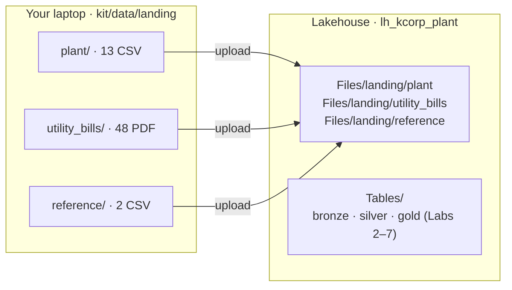

| Folder | Files | What it is |
|---|---|---|
| `plant/` | 13 CSV | MES/ERP extracts: plants, lines, assets, products, shifts, dates, defect types, customers; production runs, quality inspections, maintenance events, customer orders, anomaly alerts |
| `utility_bills/` | 48 PDF | Monthly electricity and water bills for 4 plants, Jan–Jun 2026. 13 are scans. |
| `reference/` | 2 CSV | Ground truth for the bills, and a catch-up extraction (both used in Lab 6) |

> ▶ **Watch it:** [creating the Lakehouse and folders](../docs/media/lab01-create-lakehouse.mp4) · [uploading the files](../docs/media/lab01-upload-files.mp4) (short screen recordings from the golden run)

---

### Task A: Create the Lakehouse

1. In your workspace, click **+ New item**.

   > **A first-run pop-up appears here.** A green callout titled **"Add to favorites" (1 of 2)** sits on top of the
   > item tiles and **blocks clicks on the tiles underneath**: a tile looks normal and simply doesn't respond.
   > Click **Next**, then **Done**. You only see it once.

   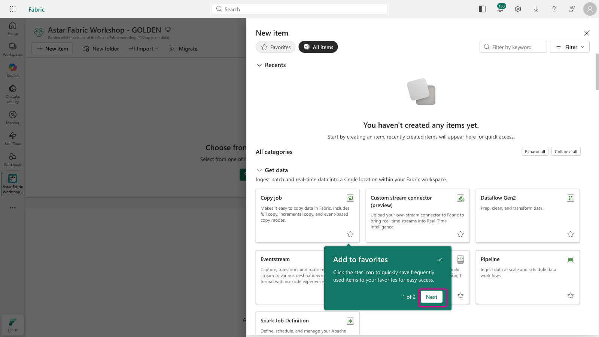

2. Type `lakehouse` into the panel's own **Filter by keyword** box (top right of the panel, *not* the Fabric
   search bar at the top of the page), then click the **Lakehouse** tile.

   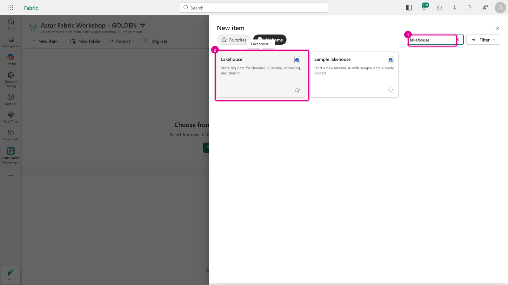

3. Name it **`lh_kcorp_plant`**, keep **Lakehouse schemas** ticked, and click **Create**.

   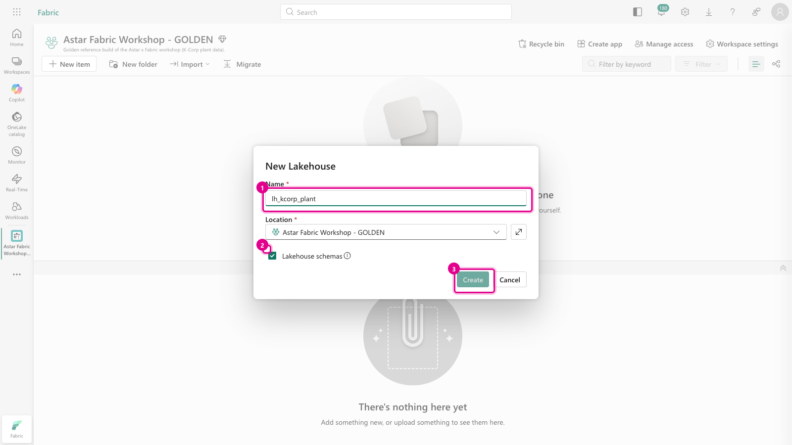

   > ⚠️ **Don't untick *Lakehouse schemas*.** It lets you keep `bronze`, `silver` and `gold` tables side by side
   > in one Lakehouse, and every notebook relies on it. It can't be switched on after creation.

4. The Lakehouse opens. **Tables** has an empty `dbo` schema, and **Files** is empty. Close the
   **"Analyze your data"** callout if it appears.

   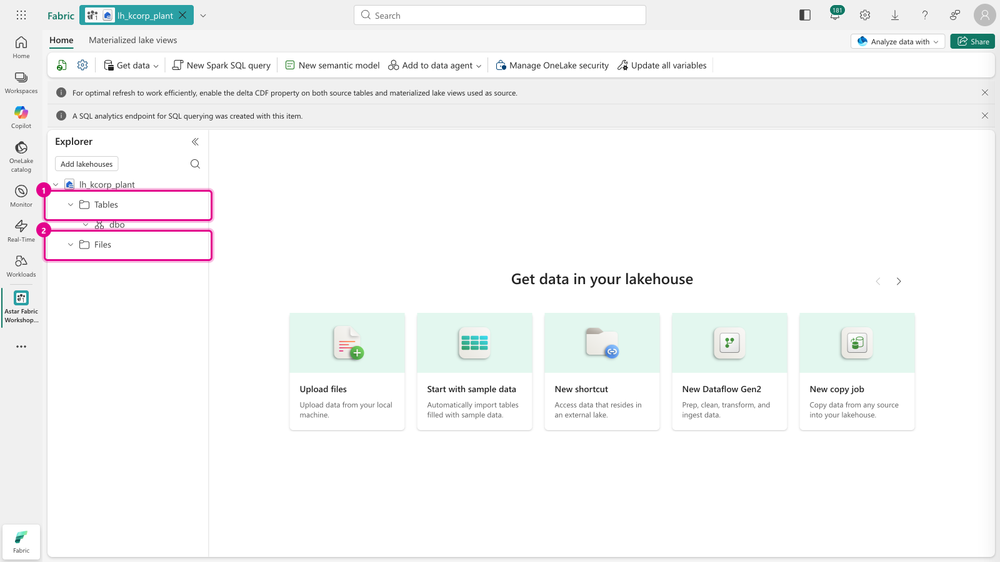

### Task B: Create the landing folders

5. Hover **Files** → click **⋯ (More options)** → **New subfolder**.

   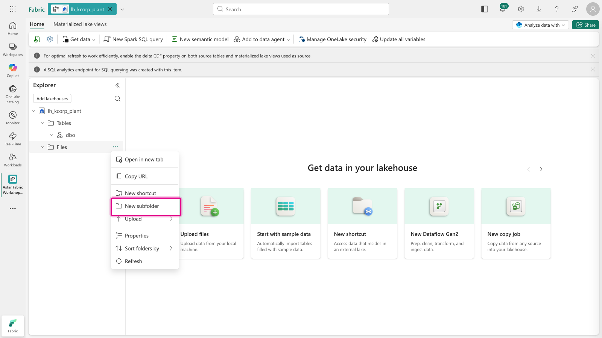

6. Name it **`landing`** and press **Enter** (or click **Create**).

   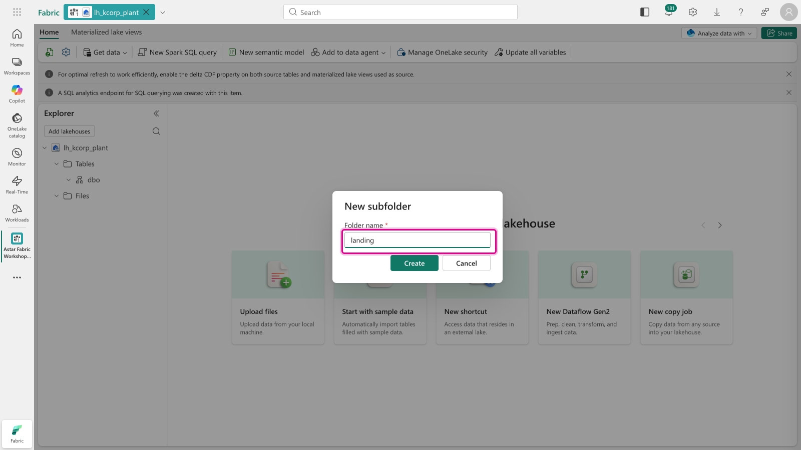

7. Now repeat on **`landing`**: hover it → **⋯** → **New subfolder**, three times, to create **`plant`**,
   **`utility_bills`** and **`reference`**.

   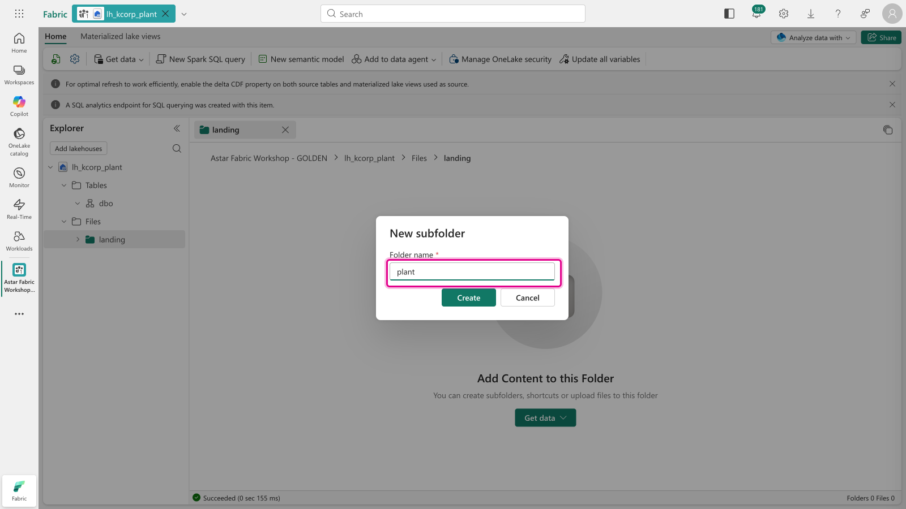

   Your Explorer should now look like this:

   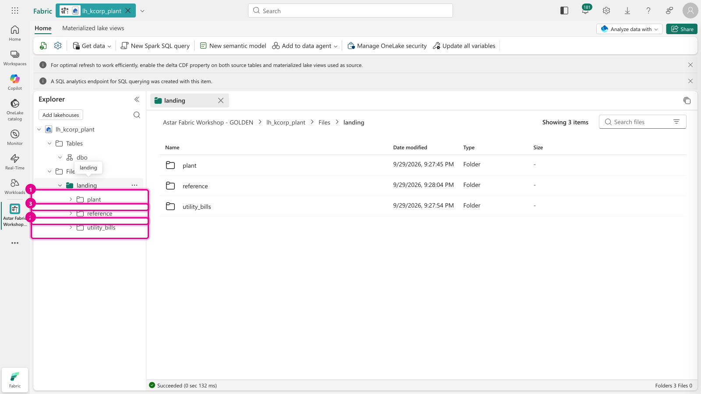

   > ⚠️ **Spelling matters.** The notebooks look for exactly `Files/landing/plant`, `Files/landing/utility_bills`
   > and `Files/landing/reference`, all lower case, with an underscore in `utility_bills`.

### Task C: Upload the files

8. Click the **`plant`** folder to open it. In the empty folder, click **Get data** → **Upload files**.

   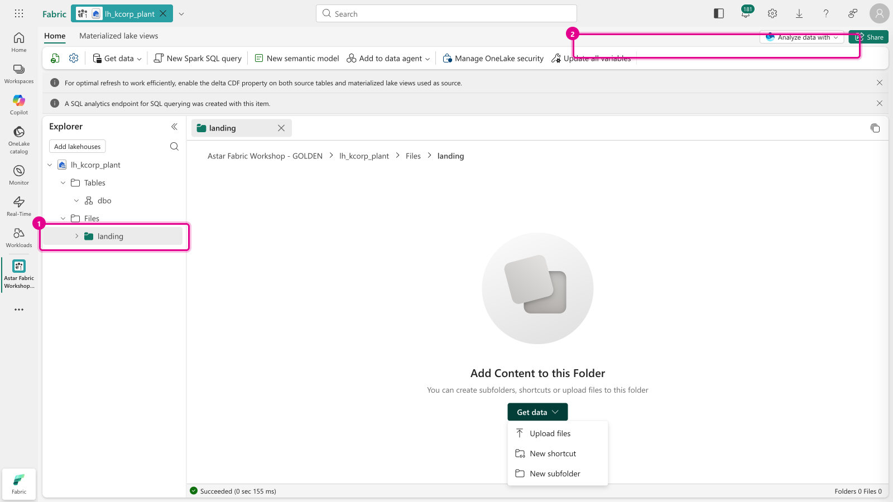

9. **Check the destination first.** The path at the top of the **Upload files** pane must end in
   **`/Files/landing/plant/`**. If it doesn't, close the pane and click the right folder first.

   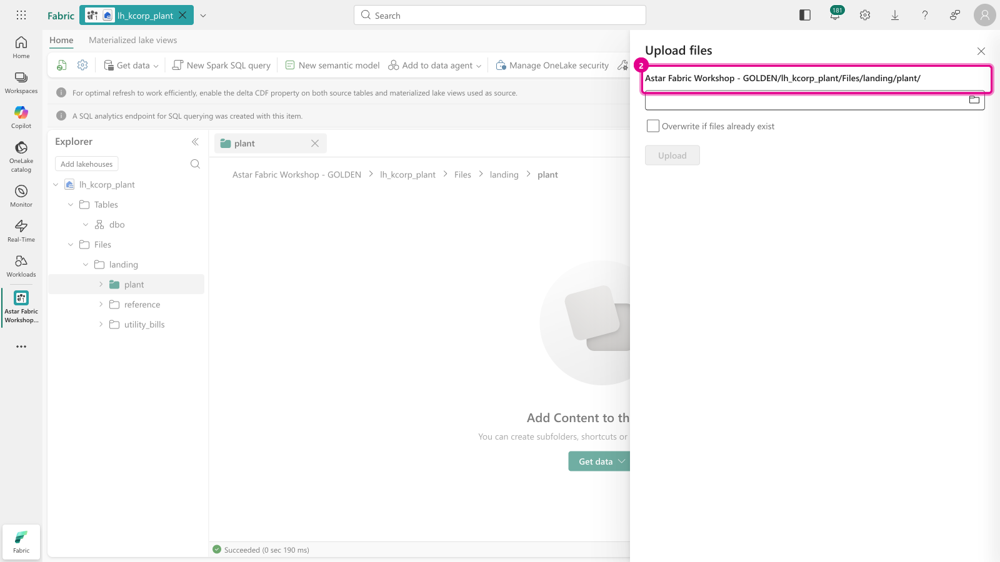

10. Click the **folder icon** in the box, go to the kit's **`data/landing/plant`** folder, select **all 13 CSV
    files** (Ctrl+A / ⌘A), and click **Open**. Then click **Upload**. Choosing the files doesn't upload them:
    the pane waits for that button.

    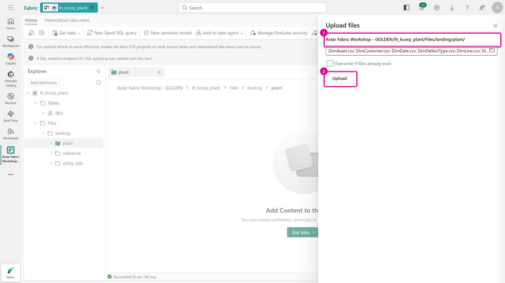

11. Watch each file reach a green ✔ under **Current uploads**.

    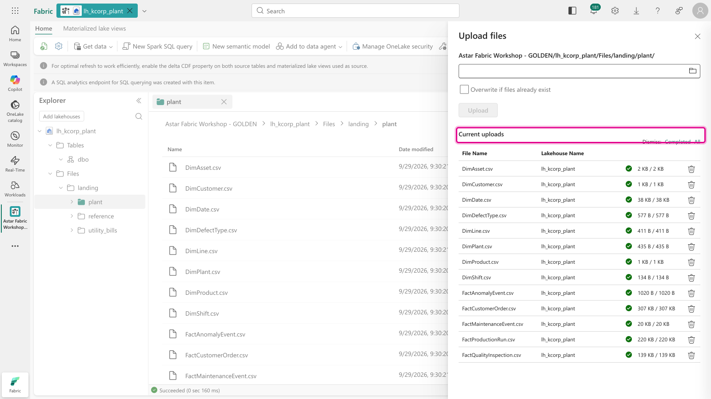

12. Repeat steps 8–11 for the other two folders:

    | Open this Lakehouse folder | Upload from the kit | Files |
    |---|---|---|
    | `landing/utility_bills` | `data/landing/utility_bills/*.pdf` | 48 |
    | `landing/reference` | `data/landing/reference/*.csv` | 2 |

    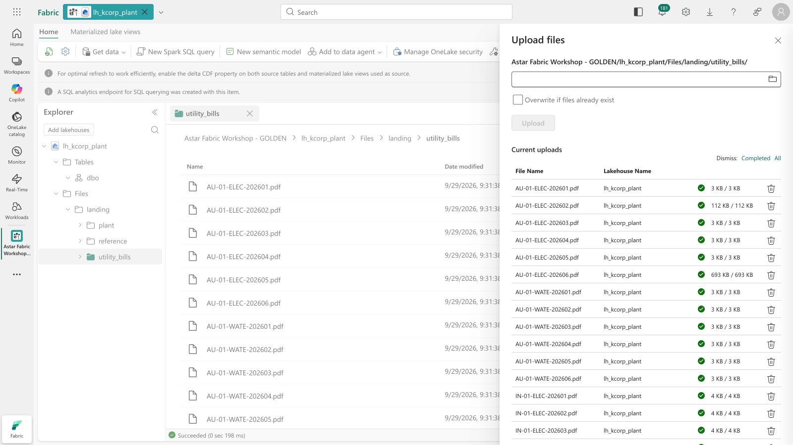

### Task D: Look inside a file

13. Open **`landing/plant`** and click **`FactProductionRun.csv`**. Fabric previews it right in the browser.
    Look closely at the `OperatorTeam` column (second from last): alongside `Team-A`, `Team-B` and `Team-C` you'll
    spot ` Team-A` with a leading space and `team-c` in lower case. **This is real-world dirt, and it's
    deliberate.** You'll clean it up in Lab 3.

    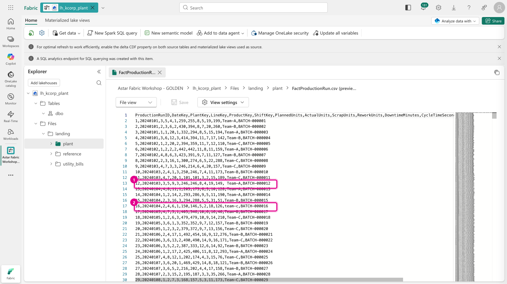

---

### ✅ Checkpoint

| Lakehouse folder | Files |
|---|---|
| `Files/landing/plant` | **13** |
| `Files/landing/utility_bills` | **48** |
| `Files/landing/reference` | **2** |

### Next up
**[Lab 2 · Bronze: raw files to Delta tables](../lab02-bronze/README.md)**
