[← Workshop home](../README.md)

# Lab 2 · Bronze: raw files to Delta tables

**⏱ 15 min** · **🎯 Goal:** 13 `bronze.*` Delta tables, one per CSV, exactly as the files arrived.

### What you'll build

A **notebook** is a page of runnable cells, some code and some explanation, that runs on **Apache Spark**, a
distributed engine that scales from a few rows to billions. You'll import a ready-made notebook, attach it to
your Lakehouse, and run it.

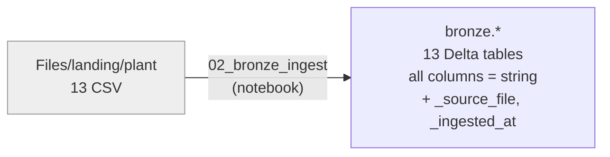

**The Bronze rule:** keep everything, judge nothing. Every column is loaded as **text**, so a bad value such as
`20250230` can't silently become an empty date. Two lineage columns record where each row came from and when.

### Files
- [`notebooks/02_bronze_ingest.ipynb`](notebooks/02_bronze_ingest.ipynb)

> ▶ **Watch it:** [attaching the Lakehouse and running the notebook](../docs/media/lab02-attach-and-run.mp4) (short screen recordings from the golden run)

---

### Task A: Import the notebook

1. Go back to your workspace. On the toolbar click **Import** → **Notebook** → **From this computer**.

   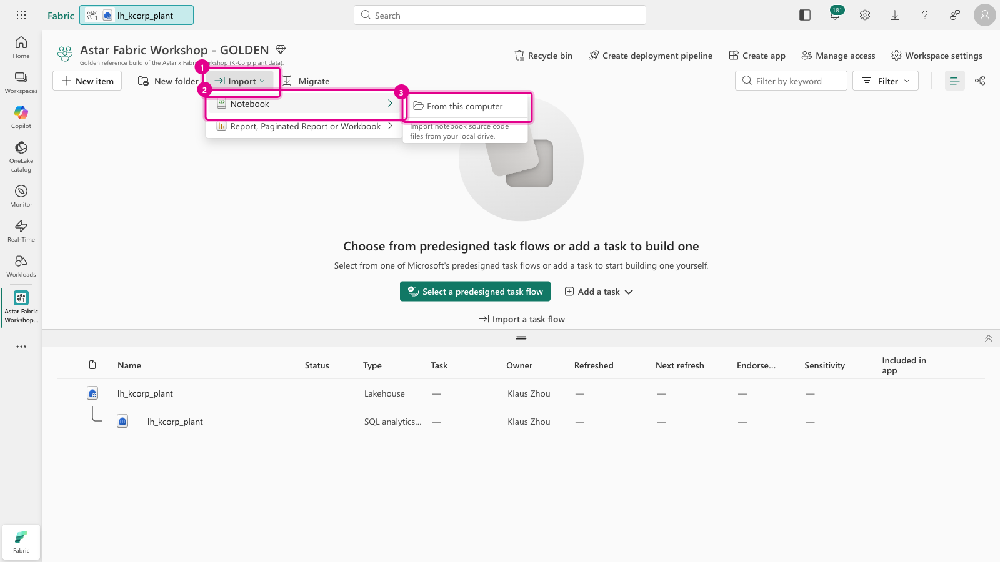

2. In the **Import status** pane, click **Upload** and select **`02_bronze_ingest.ipynb`** from the kit's
   `lab02-bronze/notebooks/` folder.

   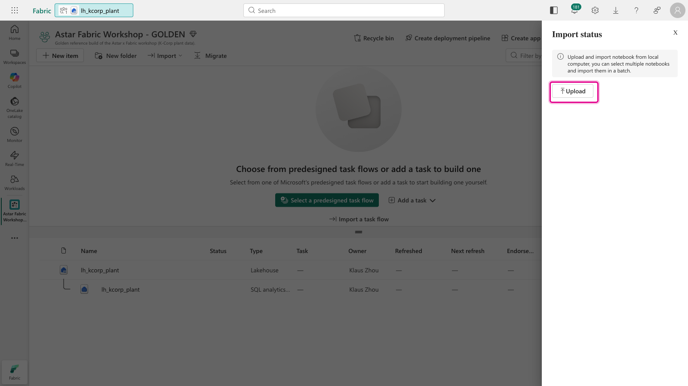

3. After **Imported successfully**, the notebook appears in your workspace list. Click it to open it.

   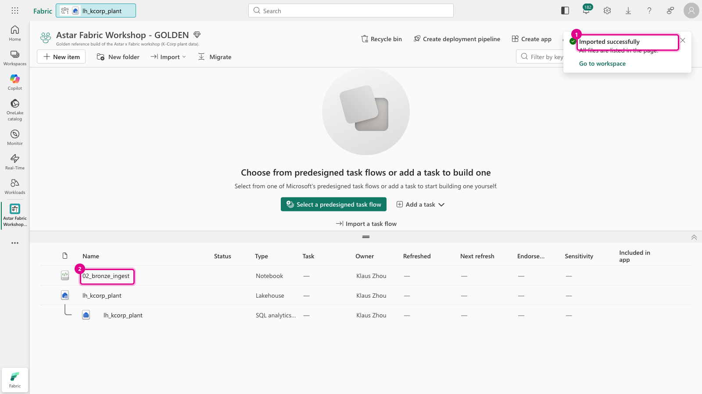

### Task B: Attach your Lakehouse

A notebook needs to know which Lakehouse to read from and write to. That's its **default Lakehouse**.

4. In the notebook's **Explorer** (left), click **Add data items** → **From OneLake catalog**.

   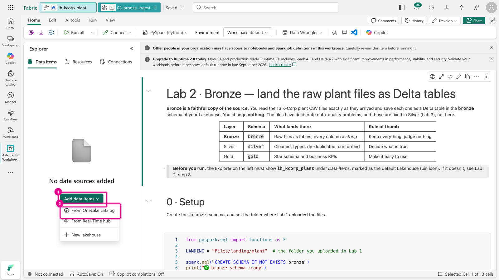

5. Type `lh_kcorp_plant` into **Filter by keyword**. **Two rows appear with the same name.** Tick the one whose
   icon is a **house with a wave** (the **Lakehouse**), then click **Add**.

   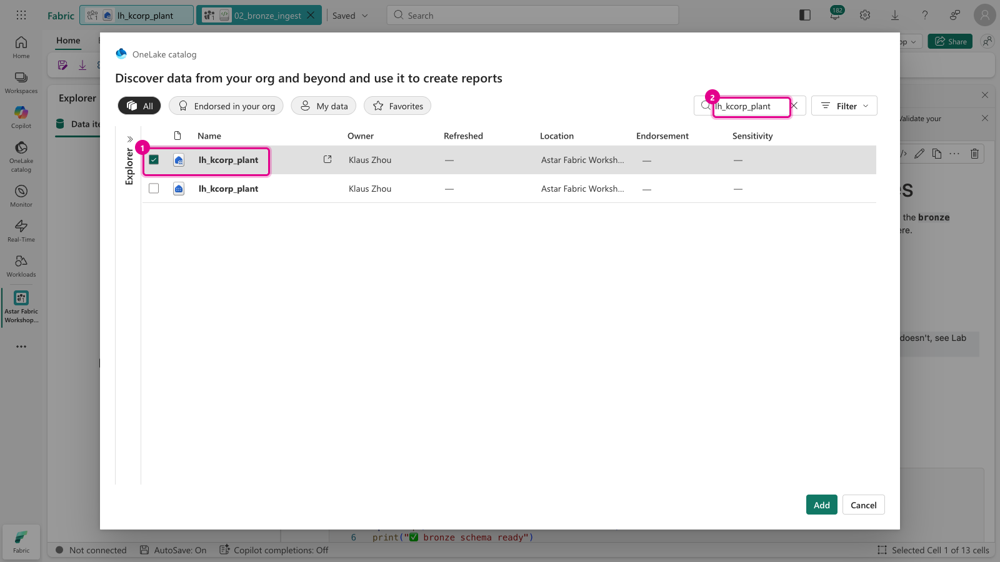

   > ⚠️ **Pick the Lakehouse, not the SQL analytics endpoint.** The second row, with a grid-of-dots icon, is the
   > Lakehouse's **SQL analytics endpoint**, a read-only SQL view of the same data. A notebook attached to it
   > can't write tables, so **Run all** would fail with a permissions error.

6. The Explorer now shows **`lh_kcorp_plant`** with a 📌 pin, which means it's the default. You're ready.

   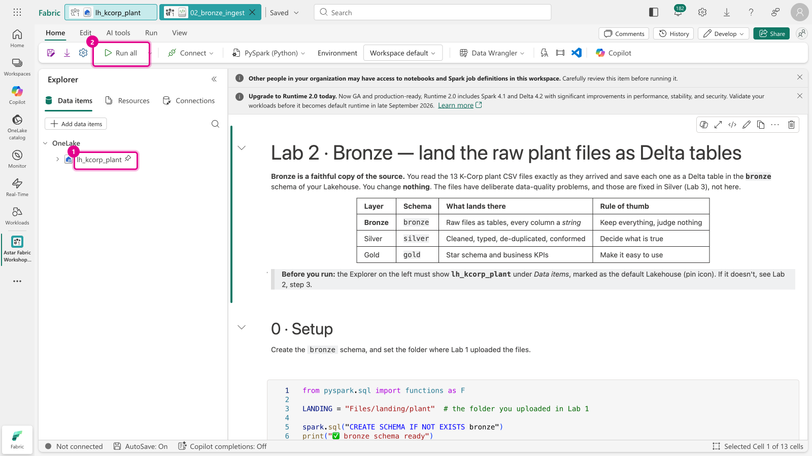

### Task C: Run it

7. Read the first two markdown cells, then click **Run all** on the toolbar.

   The first run **starts a Spark session**, which usually takes 20 seconds to 2 minutes. The status bar at the bottom
   reads *Starting* → *Session ready*. Then each cell runs in turn, with a ✔ and a timing under it.

   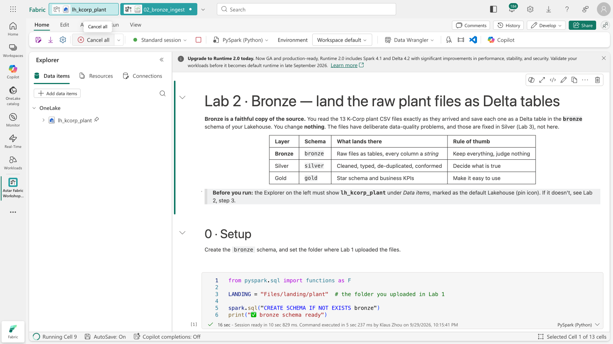

   > 🚦 **"TooManyRequestsForCapacity … HTTP 430"?** Everyone in the room shares one Fabric capacity, and each
   > notebook session reserves part of it. If you see this error, the capacity is momentarily full: wait a minute
   > and click **Run all** again. See [troubleshooting](../docs/facilitator/troubleshooting.md#spark-430).

8. Scroll through the output while it runs:
   - **Section 1** loads `FactProductionRun.csv` step by step. Note `printSchema()`: every column is `string`.
   - The **`%%sql`** cell counts runs by `OperatorTeam`. There should be **3** teams, but you'll see **18** rows:
     `Team-A` also appears as ` Team-A`, `TEAM-A `, `Team A`, `team-a` and `team_A`, and the same for B and C. That's
     what Silver will fix.

   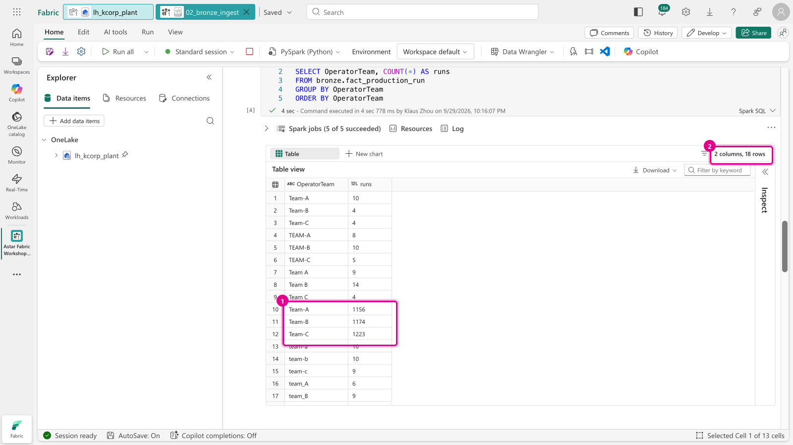

   - **Section 2** loops over the other 12 files. **Section 3** checks every row count.

9. The last cell should print **13 ✅ lines** and *"🎉 Bronze complete: 13 tables, 12,279 rows."*

   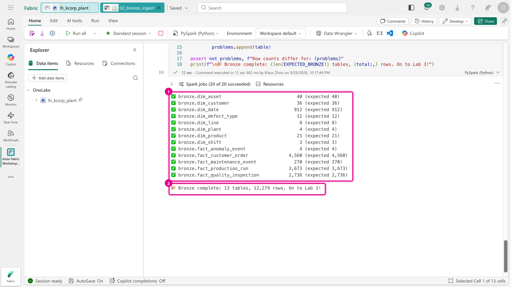

### Task D: See your tables

10. In the notebook Explorer, expand **`lh_kcorp_plant`** → **Tables** → **`bronze`**. Click **⋯** next to Tables
    → **Refresh** if they don't show yet. Click a table to preview its rows.

    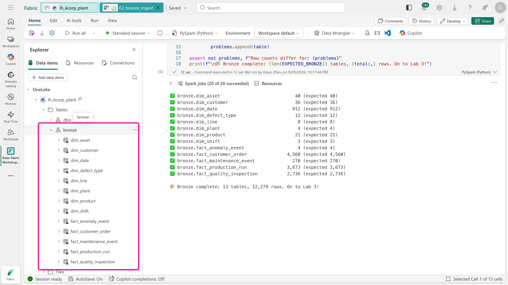

---

### ✅ Checkpoint

13 tables in `bronze`, **12,279 rows** in total:

| Table | Rows | | Table | Rows |
|---|---:|---|---|---:|
| `dim_asset` | 40 | | `fact_anomaly_event` | 4 |
| `dim_customer` | 36 | | `fact_customer_order` | 4,560 |
| `dim_date` | 912 | | `fact_maintenance_event` | 270 |
| `dim_defect_type` | 12 | | `fact_production_run` | 3,673 |
| `dim_line` | 8 | | `fact_quality_inspection` | 2,736 |
| `dim_plant` | 4 | | | |
| `dim_product` | 21 | | | |
| `dim_shift` | 3 | | | |

> **Why 21 products and 36 customers?** There are really 20 and 35. Each extract contains one duplicate row,
> and Bronze keeps it. You'll remove it in Lab 4.

### Next up
**[Lab 3 · Silver: clean the facts in code](../lab03-silver-notebook/README.md)**
