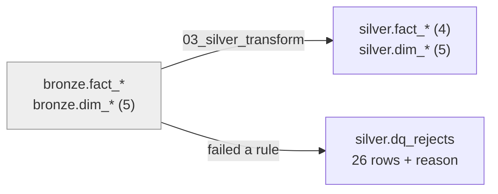
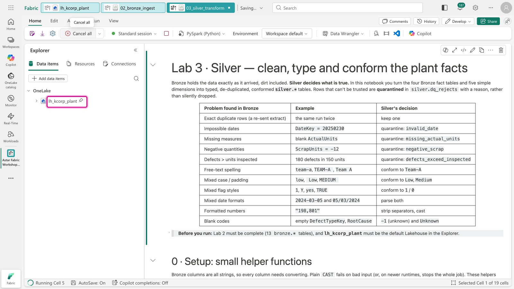
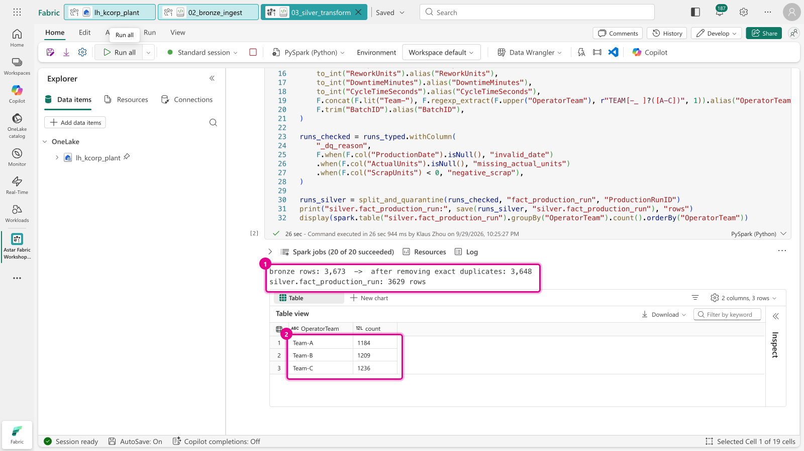
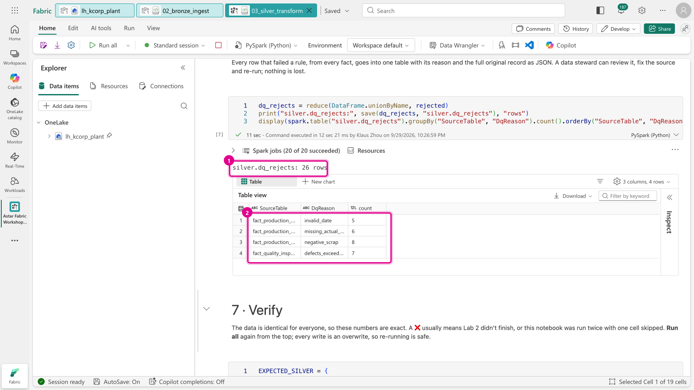
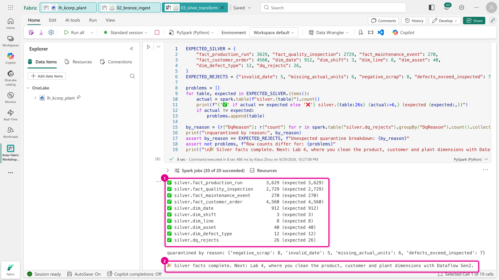
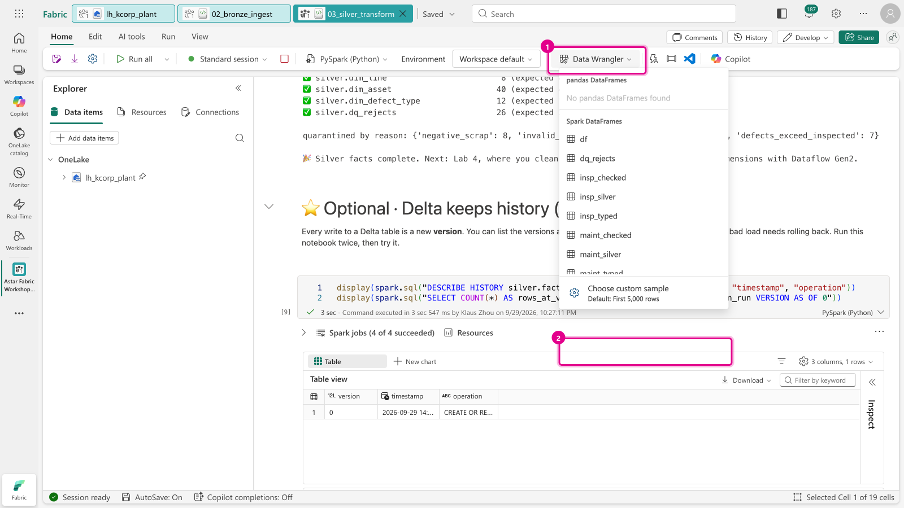
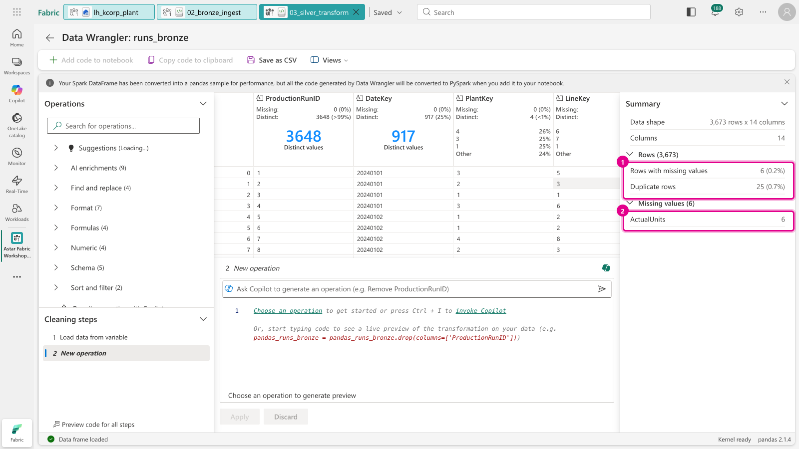
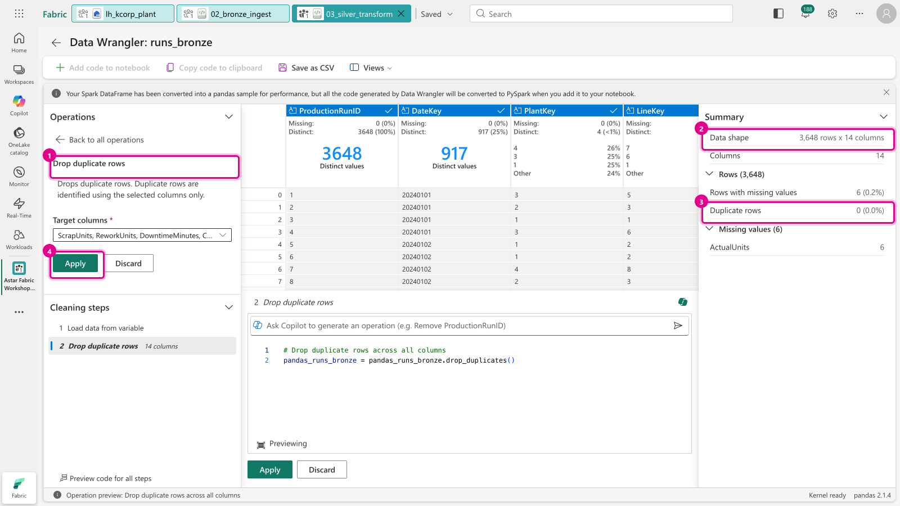
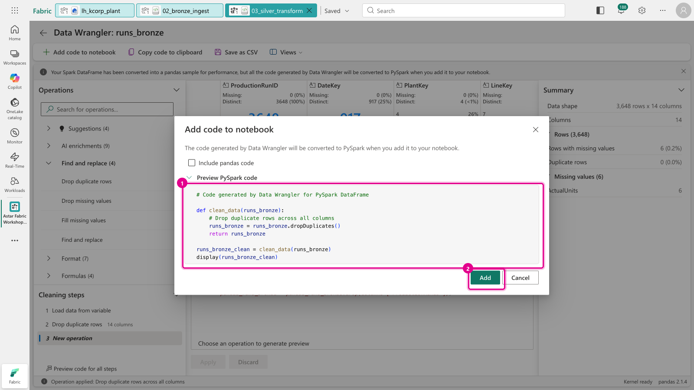
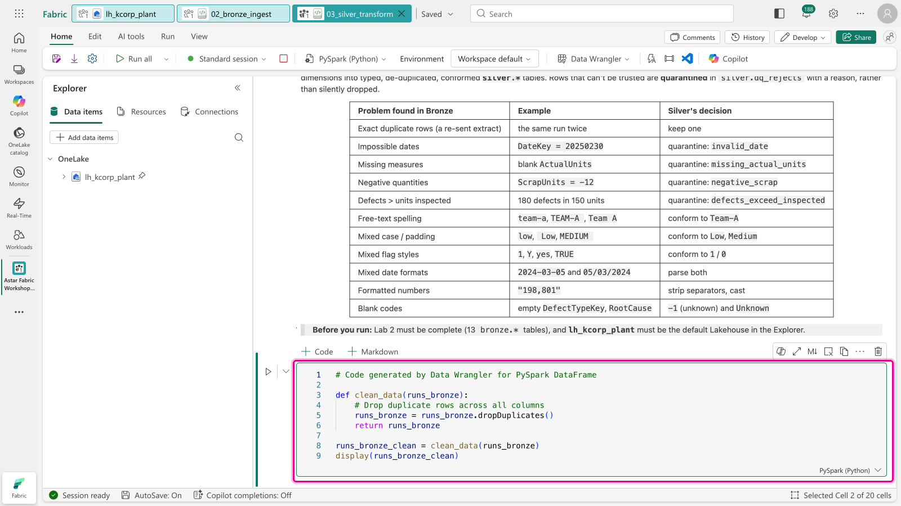

[← Workshop home](../README.md)

# Lab 3 · Silver: clean the facts in code

**⏱ 25 min** · **🎯 Goal:** typed, de-duplicated, conformed `silver.*` facts, with every rejected row explained
in a quarantine table.

### What you'll build

Bronze kept the data exactly as it arrived, dirt included. **Silver decides what is true.** The notebook applies
one rule per data-quality problem and **quarantines** the rows it can't trust, together with the reason.



These are the problems planted in the data, and what Silver does about each:

| Problem found in Bronze | Example | Silver's decision |
|---|---|---|
| Exact duplicate rows (a re-sent extract) | the same run twice | keep one |
| Impossible dates | `DateKey = 20250230` | quarantine: `invalid_date` |
| Missing measures | blank `ActualUnits` | quarantine: `missing_actual_units` |
| Negative quantities | `ScrapUnits = -12` | quarantine: `negative_scrap` |
| Defects > units inspected | 180 defects in 150 units | quarantine: `defects_exceed_inspected` |
| Free-text spelling | `team-a`, `TEAM-A `, `Team A` | conform to `Team-A` |
| Mixed case / padding | `low`, ` Low`, `MEDIUM ` | conform to `Low`, `Medium` |
| Six ways to say yes | `1`, `Y`, `yes`, `TRUE` | conform to `1` / `0` |
| Two date formats | `2024-03-05` and `05/03/2024` | parse both |
| Formatted numbers | `"198,801"` | strip separators, cast |
| Blank codes | empty `DefectTypeKey`, `RootCause` | `-1` (unknown) and `Unknown` |

### Files
- [`notebooks/03_silver_transform.ipynb`](notebooks/03_silver_transform.ipynb)

---

### Task A: Import, attach and run

1. **Import** `lab03-silver-notebook/notebooks/03_silver_transform.ipynb` exactly as in
   [Lab 2, Task A](../lab02-bronze/README.md#task-a-import-the-notebook).
2. **Attach `lh_kcorp_plant`**: *Add data items* → *From OneLake catalog* → tick the **Lakehouse** row → *Add*,
   as in [Lab 2, Task B](../lab02-bronze/README.md#task-b-attach-your-lakehouse).
3. Click **Run all**. Because a session is already warm, it may start faster this time.

   

   > 💡 **A notebook's Spark session stays open** for about 20 minutes after the last cell runs, and it holds a
   > slice of the shared capacity. When you've finished with a notebook, click **Stop session** (the red ■ next to
   > *Standard session* on the toolbar) so your neighbours' sessions can start.

### Task B: Read what each step did

4. **Section 1, `fact_production_run`**: the first line of output shows the de-duplication at work:

   ```text
   bronze rows: 3,673  ->  after removing exact duplicates: 3,648
   ```

   The table under it shows `OperatorTeam` after conforming: just **Team-A, Team-B, Team-C**.

   

5. **Section 6, the quarantine table**, groups the 26 rejected rows by source table and reason:

   

6. **Section 7, verify**: every line should be ✅.

   

### Task C (optional): Try Data Wrangler

**Data Wrangler** is Fabric's no-code cleaning tool for notebooks. You click operations, it shows a before/after
preview, and it **writes the PySpark code for you**. Try it on the raw production runs, which the notebook has
already loaded into a DataFrame called `runs_bronze`.

7. On the ribbon choose **Data Wrangler** and pick **`runs_bronze`** from the list of Spark DataFrames.

   

8. Data Wrangler profiles every column. Look at the **Summary** panel on the right: it has found the same problems
   Silver fixes, with **25 duplicate rows** and **6 missing `ActualUnits`**.

   

9. In **Operations**, expand **Find and replace** → **Drop duplicate rows**. The preview drops to **3,648 rows**
   and **0 duplicates**, exactly what the notebook's `dropDuplicates()` produced in Section 1. Click **Apply**.

   

10. Click **Add code to notebook** at the top left. The dialog shows the PySpark it generated. Click **Add**.

    

11. The new cell appears **near the top of the notebook, just after the first cell** (not at the end). You
    don't need to run it: Section 1 already does the same thing. Delete it with the 🗑 on the cell toolbar if you
    like.

    

> **Why not use Data Wrangler for everything?** It works on a *sample* (the first 5,000 rows by default, as the
> banner at the top says), which is ideal for exploring and drafting code quickly. The notebook's Silver cells are
> the repeatable, full-volume version.

### Task D (optional): Time travel

The final cell lists the table's **Delta history** and reads an older version. Run the notebook a second time
and you'll see version 1 appear. That's how you would audit or roll back a bad load.

---

### ✅ Checkpoint

| Table | Rows |
|---|---:|
| `silver.fact_production_run` | 3,629 |
| `silver.fact_quality_inspection` | 2,729 |
| `silver.fact_maintenance_event` | 270 |
| `silver.fact_customer_order` | 4,560 |
| `silver.dim_date` · `dim_shift` · `dim_line` · `dim_asset` · `dim_defect_type` | 912 · 3 · 8 · 40 · 12 |
| `silver.dq_rejects` | 26 (5 invalid_date · 6 missing_actual_units · 8 negative_scrap · 7 defects_exceed_inspected) |

### Next up
**[Lab 4 · Silver: clean the dimensions without code](../lab04-silver-dataflow/README.md)**
