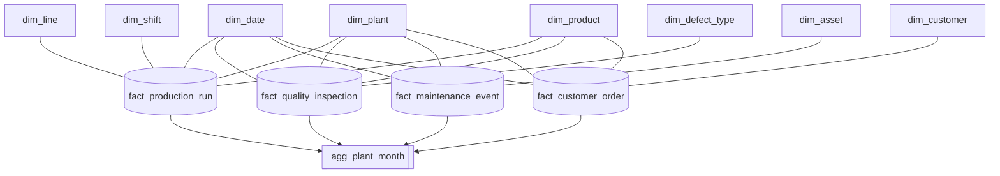
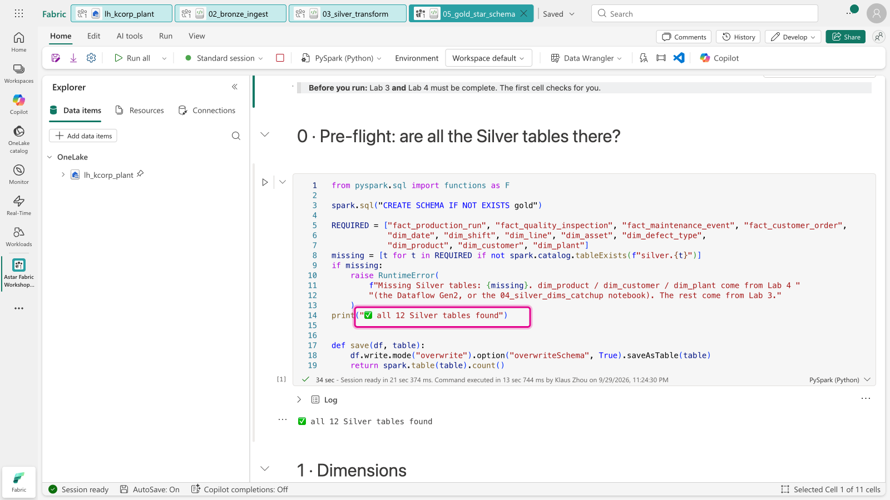
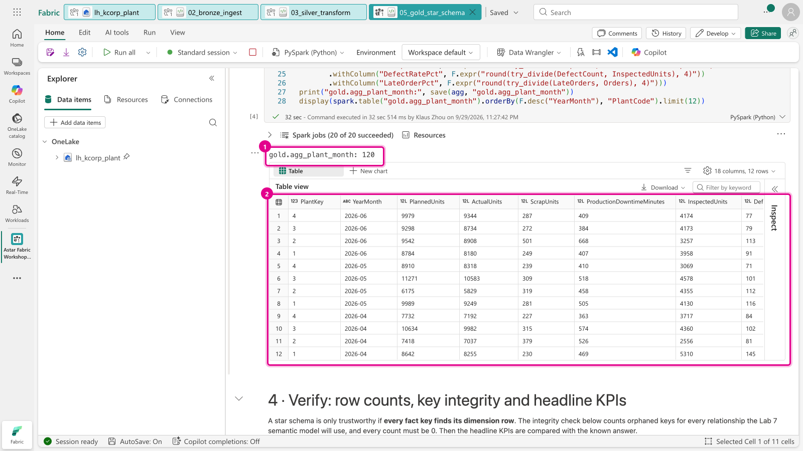
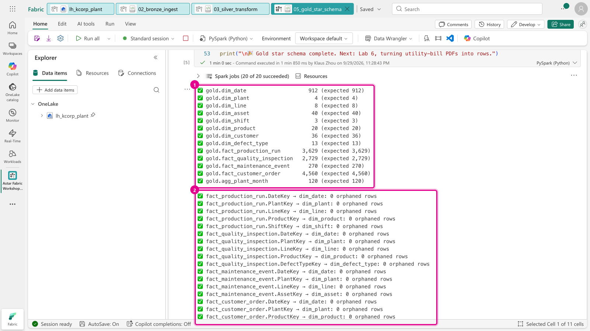
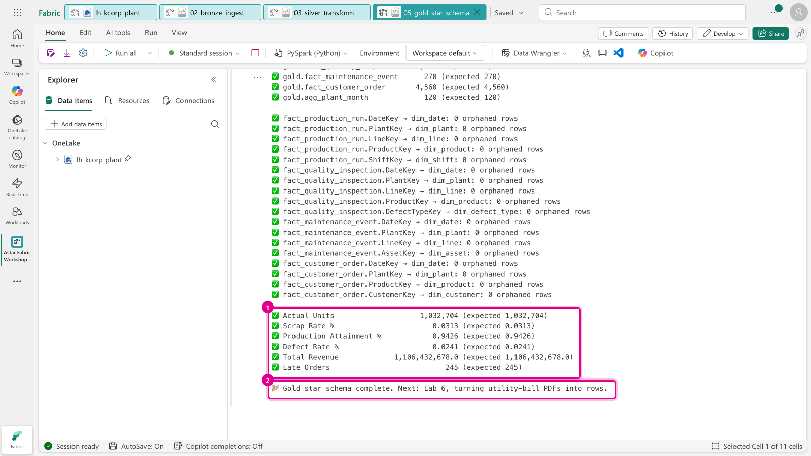
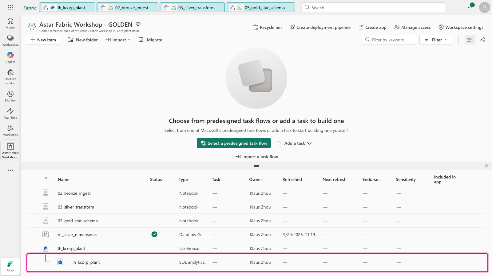
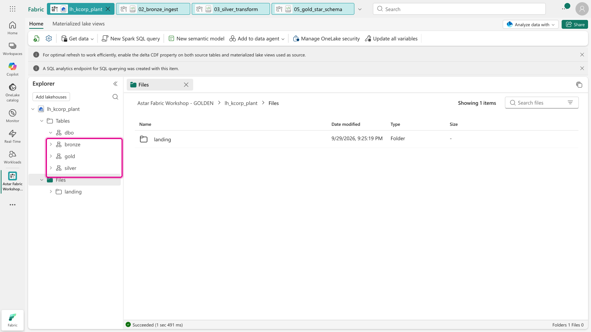
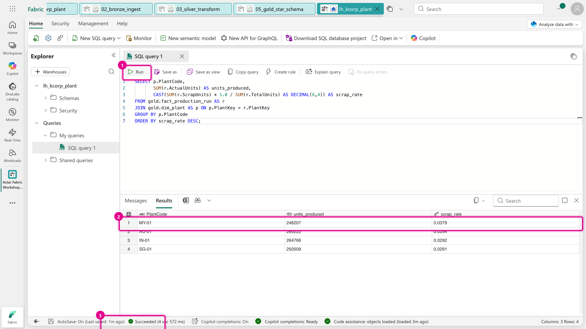

[← Workshop home](../README.md)

# Lab 5 · Gold: build the star schema

**⏱ 20 min** · **🎯 Goal:** a **star schema** in the `gold` schema, with facts surrounded by dimensions, plus a
monthly KPI table, verified for key integrity.

### What you'll build

Silver is *clean*; Gold is *useful*. A **star schema** puts each business event (a production run, an
inspection, a maintenance job, an order) in a **fact** table, joined by keys to **dimension** tables that describe
it (when, where, what, who). It's the shape Power BI and Copilot work best with, and it's what your Lab 7 semantic
model sits on.



Three ideas to look out for in the notebook:

- **Unknown members.** Every dimension that a fact can fail to match gets a row with key **`-1`**. The 12
  inspections with a blank defect code, and the 6 orders from customer `999` (who doesn't exist), still count
  in every total: they show as *Not recorded* and *Unknown customer* instead of vanishing.
- **Pre-aggregation.** `agg_plant_month` rolls four facts up to one row per plant per month, the
  first table most managers ask for.
- **Integrity checks.** The last cell checks all 18 fact-to-dimension relationships for orphaned keys. If any
  is non-zero, a report built on this model would silently undercount.

### Files
- [`notebooks/05_gold_star_schema.ipynb`](notebooks/05_gold_star_schema.ipynb)

---

### Task A: Import, attach and run

1. **Import** `lab05-gold/notebooks/05_gold_star_schema.ipynb`, **attach `lh_kcorp_plant`**, and click
   **Run all**, as in Lab 2. The first cell checks that Labs 3 **and** 4 are done. If it complains that
   `dim_product`, `dim_customer` or `dim_plant` is missing, finish Lab 4 (or run its catch-up notebook) first.

   

2. **Section 3** displays the latest rows of `gold.agg_plant_month`: attainment, scrap rate, defect rate and
   late-order rate per plant per month.

   

3. **Section 4** verifies row counts, **18 relationships with 0 orphaned rows**, and the headline KPIs.

   

   

   Click **Stop session** (■) when you're done.

### Task B: Query Gold with SQL, no Spark needed

Every Lakehouse comes with a **SQL analytics endpoint**, a read-only T-SQL view of its tables. Analysts can
query Gold without starting a Spark session.

4. Back in your workspace, `lh_kcorp_plant` now has a second row nested under it: its **SQL analytics
   endpoint**, created automatically with the Lakehouse. Click that row.

   

   > **Tip:** in the Lakehouse Explorer you can see all three medallion schemas side by side:
   >
   > 

5. Click **New SQL query**, paste the query below and click **Run** (or press Ctrl+Enter):

   ```sql
   SELECT p.PlantCode,
          SUM(r.ActualUnits)                                        AS units_produced,
          CAST(SUM(r.ScrapUnits) * 1.0 / SUM(r.TotalUnits) AS DECIMAL(6,4)) AS scrap_rate
   FROM gold.fact_production_run AS r
   JOIN gold.dim_plant          AS p ON p.PlantKey = r.PlantKey
   GROUP BY p.PlantCode
   ORDER BY scrap_rate DESC;
   ```

   **MY-01** should come out with the highest scrap rate, at about **3.8%**. The query ran in a few seconds on the
   SQL engine, with no Spark session needed.

   

   > **Tables missing, or "Invalid object name"?** The SQL endpoint's list of tables can lag a minute behind
   > Spark. Click **Refresh** (⟳) on the ribbon and run the query again.

---

### ✅ Checkpoint

| Table | Rows | | Table | Rows |
|---|---:|---|---|---:|
| `gold.dim_date` | 912 | | `gold.fact_production_run` | 3,629 |
| `gold.dim_plant` | 4 | | `gold.fact_quality_inspection` | 2,729 |
| `gold.dim_line` | 8 | | `gold.fact_maintenance_event` | 270 |
| `gold.dim_asset` | 40 | | `gold.fact_customer_order` | 4,560 |
| `gold.dim_shift` | 3 | | `gold.agg_plant_month` | 120 |
| `gold.dim_product` | 20 | | | |
| `gold.dim_customer` | 36 *(35 + Unknown)* | | | |
| `gold.dim_defect_type` | 13 *(12 + Not recorded)* | | | |

Headline KPIs: **Actual Units 1,032,704 · Scrap Rate 3.13% · Attainment 94.26% · Defect Rate 2.41%.**

### Next up
**[Lab 6 · Unstructured data: PDFs to rows with AI](../lab06-unstructured-ai/README.md)**
