[← Workshop home](../README.md)

# Lab 6 · Unstructured data: PDFs to rows with AI

**⏱ 30 min** · **🎯 Goal:** turn 48 utility-bill PDFs, 13 of them scans, into a checked fact table that joins your
star schema, using **Fabric AI Functions**. No keys and no extra Azure services.

### Why this matters

Plenty of manufacturing data arrives as **documents**: utility bills, supplier certificates, calibration reports,
delivery notes. The K-Corp plants receive a monthly electricity and water bill each from four different utility
providers:

| Plant | Provider layout | Quirk |
|---|---|---|
| SG-01 Singapore | modern statement | Water in **Cu M** |
| MY-01 Malaysia | bordered form, **Bahasa + English** | Electricity in **kWj** (*kilowatt-jam*) |
| IN-01 India | dense government form | Grouped digits such as `1,111,921.81` · water in **KL** |
| AU-01 Australia | consumer-style bill | Water in **kL** |

**13 of the 48 bills are scans**: pictures of paper with no text layer at all.

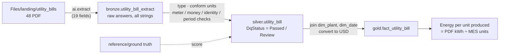

> **What replaced Azure Document Intelligence?** The original K-Corp build read these bills with Azure AI
> Document Intelligence and Content Understanding, which meant two Azure resources, a custom analyzer and RBAC
> set-up. **AI Functions** run inside the notebook on Fabric's built-in AI endpoint and bill to your Fabric
> capacity. You describe the fields in plain English and the model reads each PDF, including the scans.

### Files
- [`notebooks/06_utility_bills_ai.ipynb`](notebooks/06_utility_bills_ai.ipynb)
- `data/landing/reference/utility_bills_ground_truth.csv`: the correct answer for every bill (for scoring)
- `data/landing/reference/utility_bills_extracted_catchup.csv`: a golden-run extraction, if AI Functions aren't available

> ▶ **Watch it:** [extracting all 48 bills with ai.extract](../docs/media/lab06-extract-48-bills.mp4) (short screen recordings from the golden run)

---

### Task A: Look at a few bills

1. In `lh_kcorp_plant` → **Files** → `landing` → `utility_bills`, click **`IN-01-ELEC-202601.pdf`**. Fabric
   previews PDFs right in the browser. This is a *digital* bill from the Indian provider.

   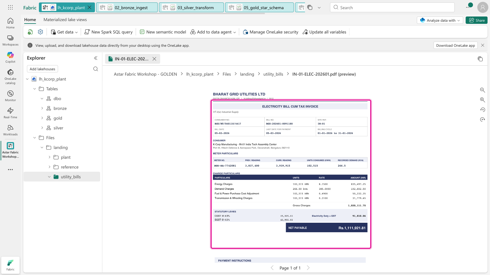

2. Now click **`SG-01-ELEC-202603.pdf`**. This one is a **scan**: grey, skewed and speckled, with no text inside.
   Keep both in mind.

   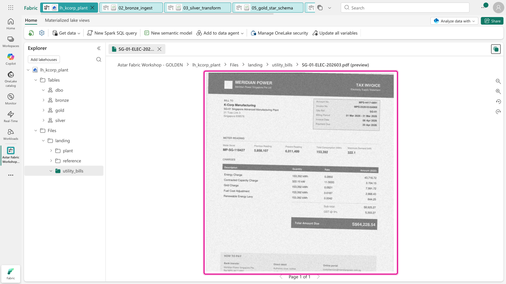

### Task B: Import, attach and run step by step

3. **Import** `lab06-unstructured-ai/notebooks/06_utility_bills_ai.ipynb` and **attach `lh_kcorp_plant`**, as in
   Lab 2.
4. This time, **run the cells one at a time** (click ▷ on each cell, or press **Shift+Enter**) so you can read
   each result.

   - **Step 0** installs two small packages. `%pip` restarts Python (the output says *"PySpark kernel has been
     restarted"*), which is why it comes first. Then run the setup cell: it should print **found 48 bills**.
   - **Step 1** reads each PDF's text layer the ordinary way. **35 bills have text and 13 don't**: the
     scanned bill comes back as an empty string.

     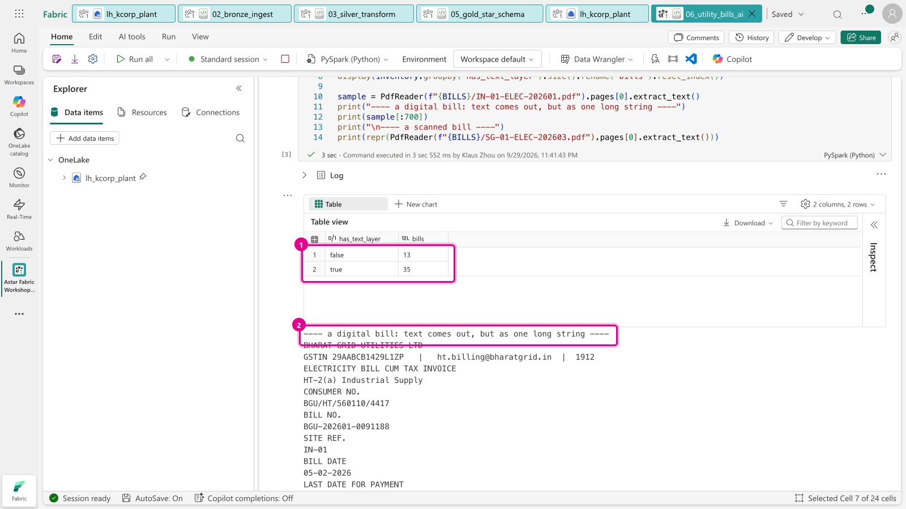

     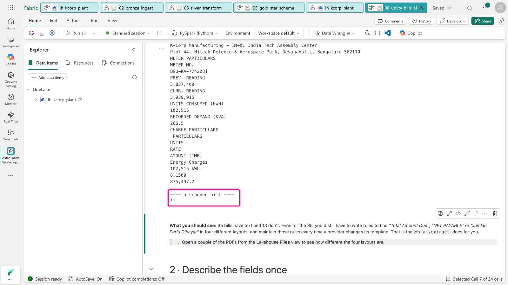

   - **Step 2** defines 19 fields in plain English, each an `ExtractLabel` with a type. Then it tries them on
     **one scanned bill** (it takes 10–20 seconds). Every field comes back, from a picture: compare the values
     with the scan you opened in step 2, for example *Total Amount Due* **64,228.54**.

     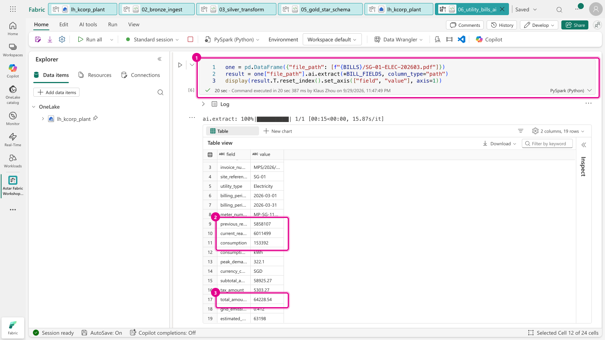

   - **Step 3** extracts **all 48 bills** into `bronze.utility_bill_extract`. The progress bar reads *48/48*; it took
     **25 seconds** in the golden run.

     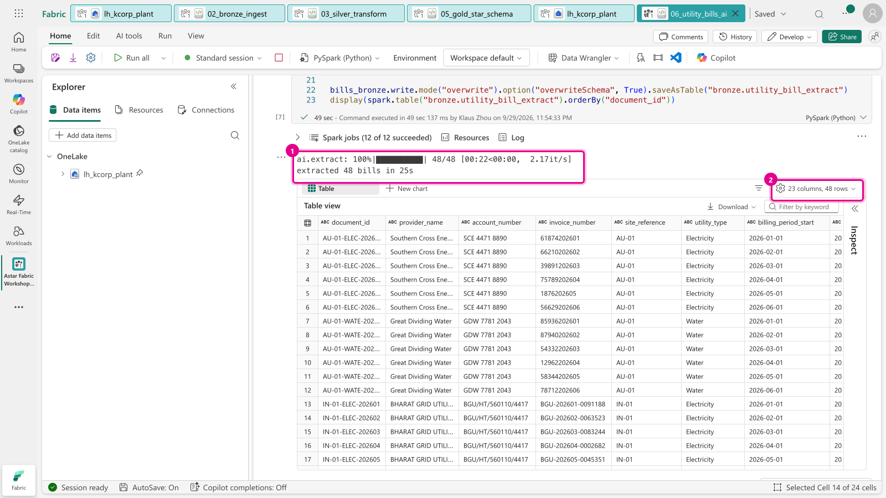

     > 🆘 **Error here?** If AI Functions aren't enabled on your capacity (for example a *Trial* workspace, or
     > the Copilot tenant setting is off), set `USE_CATCHUP = True` at the top of the cell and run it again. The
     > rest of the lab works the same.

### Task C: Silver: confidence is not correctness

5. **Step 4** types the values and runs four **self-consistency checks** on every bill: the meter readings must
   add up to the consumption, the subtotal plus tax must equal the total, the plant code must be real, and the
   billing month must match the month in the file name. A bill that fails any check is flagged **`Review`**.

   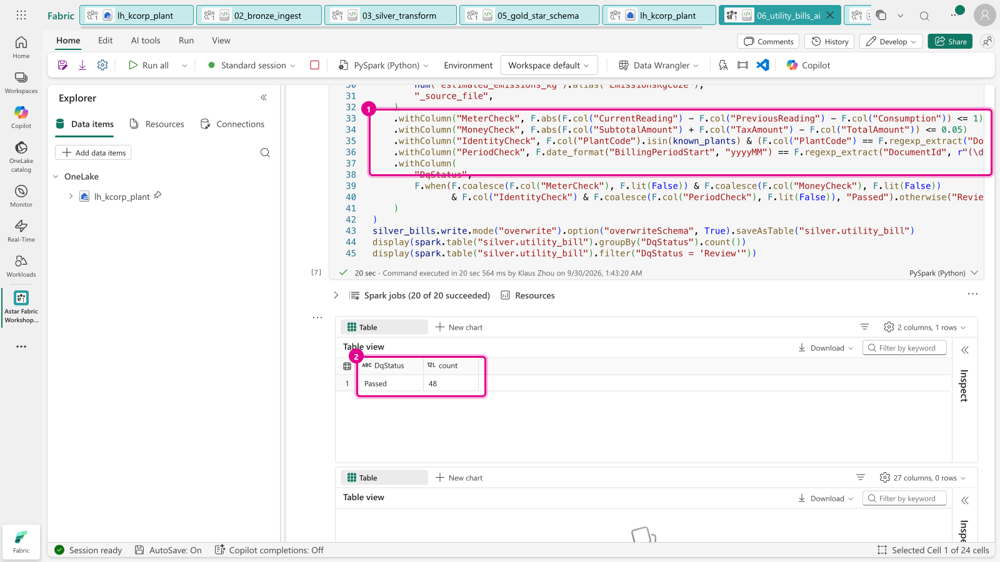

6. **Step 5** scores the AI against the **ground truth**, field by field.

   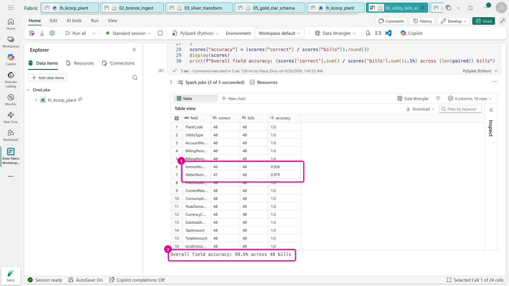

   **Your numbers will differ slightly from your neighbour's: an LLM is not deterministic.** In the golden run
   field accuracy was **99.6%**. Every amount, reading and date was right, but two invoice numbers and one meter number
   were not (earlier dry runs saw a dropped digit, and an en-dash `–` read instead of a hyphen `-`). Yet in Step 4
   **all 48 bills passed**, because the four checks only test arithmetic and dates.

   **Discuss with your neighbour:**
   - Did you get any misses? Were they on scanned or digital bills?
   - The meter and money checks **can't catch** a wrong invoice number, because it isn't used in any arithmetic.
     What rule would you add? (Hint: every provider uses a fixed pattern.)

### Task D: Gold, and the payoff

7. **Step 6** writes **`gold.fact_utility_bill`**, joined to the *same* `dim_plant` and `dim_date` as your
   production data, with amounts converted to USD.
8. **Step 7** answers a question neither source can answer alone: **how many kWh does each plant use per unit
   produced?** Electricity comes from the PDFs; units come from the MES.

   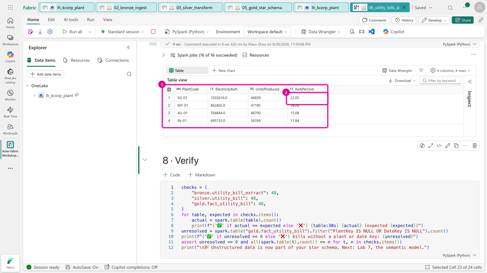

   > **SG-01** uses the most energy per unit, at about **22 kWh**, against about **12 kWh** at IN-01.
   > That's a question for the plant manager, and you answered it from a stack of PDFs.

9. **Step 8** verifies: 48 rows in each layer, and every bill matches a row in `dim_plant` and in `dim_date`. Then click
   **Stop session**.

   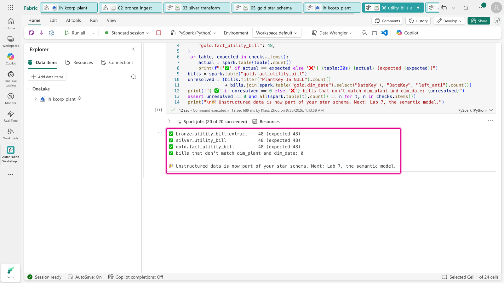

---

### How it works: `ai.extract` in three lines

```python
import synapse.ml.aifunc as aifunc

fields = [
    aifunc.ExtractLabel("total_amount_due", description="Final total payable incl. tax", type="number", max_items=1)
]
df["file_path"].ai.extract(*fields, column_type="path")  # one column per field, one row per PDF
```

`column_type="path"` tells the function that the column holds **file paths**, not text, so it sends the PDF
itself (pages as images plus any text) to the model. The same pattern works for images and for other AI Functions:
`ai.classify`, `ai.summarize` and `ai.analyze_sentiment`. See the
[AI Functions documentation](https://learn.microsoft.com/fabric/data-science/ai-functions/overview).

> **Cost:** AI Functions consume Fabric capacity units, which appear as the *AI Functions* operation in the
> Capacity Metrics app. Extracting all 48 bills is a few cents' worth.

### ✅ Checkpoint
- [ ] `bronze.utility_bill_extract`, `silver.utility_bill`, `gold.fact_utility_bill`: **48 rows each**
- [ ] Every bill has a `PlantKey` and a `DateKey`
- [ ] You can explain why a field can be *confidently wrong*, and what catches it

### Next up
**[Lab 7 · Semantic model](../lab07-semantic-model/README.md)**
