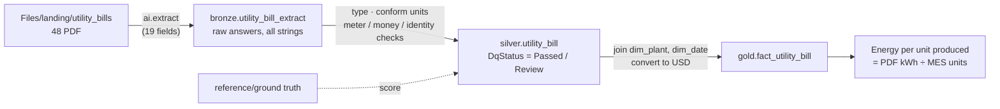

[← Workshop home](../README.md)

# Lab 6 · Unstructured data: PDFs to rows with AI

**⏱ 30 min** · **🎯 Goal:** turn 48 utility-bill PDFs, 13 of them scans, into a checked fact table that joins your
star schema, using **Fabric AI Functions**. No keys and no extra Azure services.

### Why this matters

Plenty of manufacturing data arrives as **documents**: utility bills, supplier certificates, calibration reports,
delivery notes. The K-Corp plants receive a monthly electricity and water bill each from four different utility
providers:

| Plant | Provider layout | Quirk |
|---|---|---|
| SG-01 Singapore | modern statement | Water in **Cu M** |
| MY-01 Malaysia | bordered form, **Bahasa + English** | Electricity in **kWj** (*kilowatt-jam*) |
| IN-01 India | dense government form | Grouped digits such as `1,111,921.81` · water in **KL** |
| AU-01 Australia | consumer-style bill | Water in **kL** |

**13 of the 48 bills are scans**: pictures of paper with no text layer at all.



> **What replaced Azure Document Intelligence?** The original K-Corp build read these bills with Azure AI
> Document Intelligence and Content Understanding, which meant two Azure resources, a custom analyzer and RBAC
> set-up. **AI Functions** run inside the notebook on Fabric's built-in AI endpoint and bill to your Fabric
> capacity. You describe the fields in plain English and the model reads each PDF, including the scans.

### Files
- [`notebooks/06_utility_bills_ai.ipynb`](notebooks/06_utility_bills_ai.ipynb)
- `data/landing/reference/utility_bills_ground_truth.csv`: the correct answer for every bill (for scoring)
- `data/landing/reference/utility_bills_extracted_catchup.csv`: a golden-run extraction, if AI Functions aren't available

---

### Task A: Look at a few bills

1. In `lh_kcorp_plant` → **Files** → `landing` → `utility_bills`, click **`IN-01-ELEC-202601.pdf`**, then
   **`SG-01-ELEC-202603.pdf`**. The first is a digital bill; the second is a heavily degraded scan. Keep both in
   mind.

   

### Task B: Import, attach and run step by step

2. **Import** `lab06-unstructured-ai/notebooks/06_utility_bills_ai.ipynb` and **attach `lh_kcorp_plant`**, as in
   Lab 2.
3. This time, **run the cells one at a time** (click ▷ on each cell, or press **Shift+Enter**) so you can read
   each result.

   - **Step 0** installs two small packages. `%pip` restarts Python, which is why it comes first.
   - **Step 1** reads each PDF's text layer the ordinary way. **35 bills have text and 13 don't**: the
     scanned bill comes back as an empty string.

     

   - **Step 2** defines 19 fields in plain English, each an `ExtractLabel` with a type. Then it tries them on
     **one scanned bill**. Every field comes back, from a picture.

     

   - **Step 3** extracts **all 48 bills** into `bronze.utility_bill_extract`. It took about 30 seconds in the golden run.

     

     > 🆘 **Error here?** If AI Functions aren't enabled on your capacity (for example a *Trial* workspace, or
     > the Copilot tenant setting is off), set `USE_CATCHUP = True` at the top of the cell and run it again. The
     > rest of the lab works the same.

### Task C: Silver: confidence is not correctness

4. **Step 4** types the values and runs three **self-consistency checks** on every bill: the meter readings must
   add up to the consumption, the subtotal plus tax must equal the total, and the plant code must be real. A bill
   that fails any check is flagged **`Review`**.

   

5. **Step 5** scores the AI against the **ground truth**, field by field.

   

   **Discuss with your neighbour:**
   - Which fields were missed, and were they on scanned or digital bills?
   - In the golden run, a few *identifier* fields differed from the truth: a dropped digit in an invoice number,
     an en-dash `–` read instead of a hyphen `-`. **The meter and money checks can't catch those**, because
     they aren't used in any arithmetic. What would you check for an invoice number?

### Task D: Gold, and the payoff

6. **Step 6** writes **`gold.fact_utility_bill`**, joined to the *same* `dim_plant` and `dim_date` as your
   production data, with amounts converted to USD.
7. **Step 7** answers a question neither source can answer alone: **how many kWh does each plant use per unit
   produced?** Electricity comes from the PDFs; units come from the MES.

   

   > **SG-01** uses the most energy per unit, at about **22 kWh**, against about **12 kWh** at IN-01.
   > That's a question for the plant manager, and you answered it from a stack of PDFs.

8. **Step 8** verifies: 48 rows in each layer, and every bill matched to a plant and a date.

---

### How it works: `ai.extract` in three lines

```python
import synapse.ml.aifunc as aifunc

fields = [
    aifunc.ExtractLabel("total_amount_due", description="Final total payable incl. tax", type="number", max_items=1)
]
df["file_path"].ai.extract(*fields, column_type="path")  # one column per field, one row per PDF
```

`column_type="path"` tells the function that the column holds **file paths**, not text, so it sends the PDF
itself (pages as images plus any text) to the model. The same pattern works for images and for other AI Functions:
`ai.classify`, `ai.summarize` and `ai.analyze_sentiment`. See the
[AI Functions documentation](https://learn.microsoft.com/fabric/data-science/ai-functions/overview).

> **Cost:** AI Functions consume Fabric capacity units, which appear as the *AI Functions* operation in the
> Capacity Metrics app. Extracting all 48 bills is a few cents' worth.

### ✅ Checkpoint
- [ ] `bronze.utility_bill_extract`, `silver.utility_bill`, `gold.fact_utility_bill`: **48 rows each**
- [ ] Every bill has a `PlantKey` and a `DateKey`
- [ ] You can explain why a field can be *confidently wrong*, and what catches it

### Next up
**[Lab 7 · Semantic model](../lab07-semantic-model/README.md)**
