[← Workshop home](../README.md)

# Lab 7 · Semantic model

**⏱ 25 min** · **🎯 Goal:** a **Direct Lake** semantic model, `sm_kcorp_plant`, over your Gold star schema, with
20 relationships and 17 measures whose numbers you've checked.

### What you'll build

A **semantic model** is the business layer between your tables and the people (and AI) asking questions. It holds
the **relationships** (how facts join dimensions) and the **measures** (the agreed definitions of *Scrap Rate %*,
*Late Order %* and so on), so every report and every Copilot answer uses the same maths.

**Direct Lake** means the model reads the Gold Delta tables in OneLake **directly**: no import, no copy, no
scheduled refresh. When your notebooks rewrite Gold, the model sees the new data.

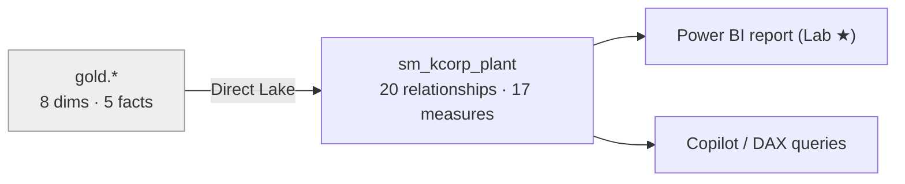

### Files
- [`assets/copilot-prompts.md`](assets/copilot-prompts.md): the prompts for Tasks C and D
- [`assets/check-measures.dax`](assets/check-measures.dax): the DAX query for Task E
- [`notebooks/07_semantic_model_catchup.ipynb`](notebooks/07_semantic_model_catchup.ipynb): **catch-up** that adds whatever is missing

> ⚠️ **Licence check:** a semantic model is a Power BI item. Each participant needs **Power BI Pro** (or Premium Per
> User) to create one in a shared workspace. If you can't, pair up with a neighbour. See the
> [pre-flight](../docs/facilitator/preflight-checklist.md#4--participant-accounts-and-workspaces).

> ▶ **Watch it:** [Copilot creating the 19 relationships](../docs/media/lab07-copilot-relationships.mp4) (short screen recordings from the golden run)

---

### Task A: Create the model from the SQL analytics endpoint

1. Open the **`lh_kcorp_plant` SQL analytics endpoint** (the row nested under the Lakehouse in your workspace; see
   Lab 5). On the ribbon click **New semantic model**.

   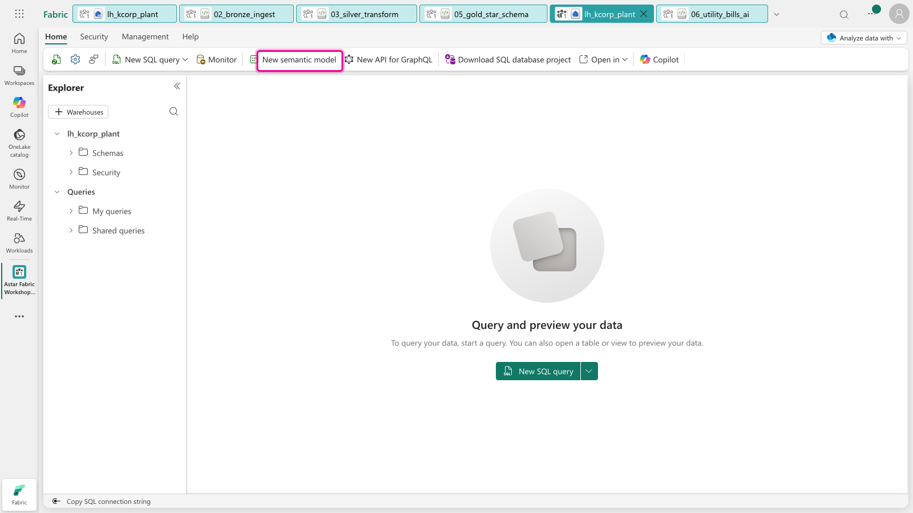

2. Name it **`sm_kcorp_plant`** and keep **Direct Lake on SQL**. In the table list, collapse `bronze` and `silver`,
   tick the **`gold`** schema, then **untick `agg_plant_month`**. It's a pre-aggregated copy of the facts, and
   including it would double-count.

   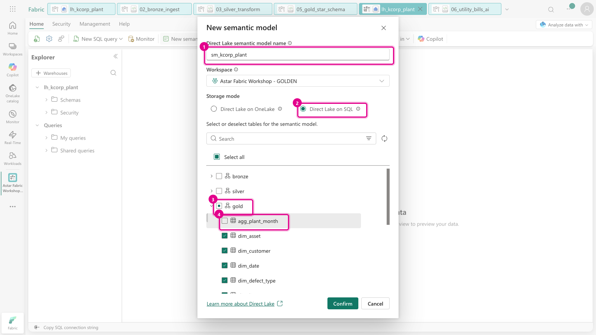

3. Scroll down to check that all 13 tables are ticked (8 `dim_*`, 5 `fact_*` including `fact_utility_bill`), then click **Confirm**.

   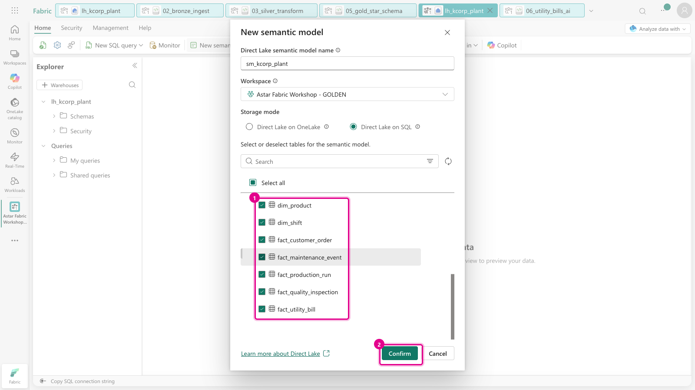

   > **"Error Loading Data Model … storage mode is currently being updated"?** The model sometimes opens in a new
   > tab before it has finished creating. Close the message and the tab, then open `sm_kcorp_plant` from the
   > workspace list a minute later. It's fine; don't press Confirm again, or you'll get a second model.

4. Open **`sm_kcorp_plant`** from the workspace list.

   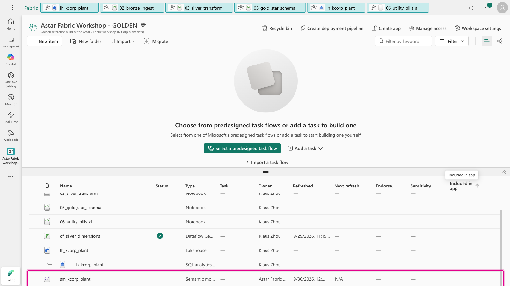

5. It opens in **Viewing** mode (read-only). Click **Viewing** (top right) → **Editing**.

   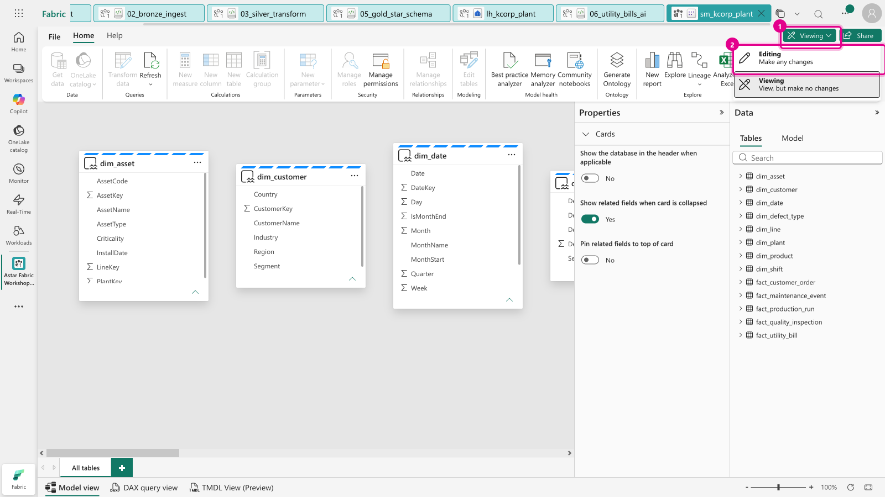

### Task B: The first relationship, by hand

6. On the ribbon click **Manage relationships** → **+ New relationship**, and set:

   | | |
   |---|---|
   | **From table** | `fact_production_run` → click the **PlantKey** column header |
   | **To table** | `dim_plant` → click the **PlantKey** column header |

   Fabric works out the rest by itself: **Many to one (\*:1)**, cross-filter **Single**, **Make this relationship
   active** ✔. Those are exactly right for a star schema. Click **Save**.

   > The data previews say *"A preview of this table isn't available"*. That's normal for Direct Lake in this
   > dialog, and it doesn't affect anything.

   ![New relationship: fact_production_run[PlantKey] → dim_plant[PlantKey], Many to one, Single, active.](../docs/images/lab07/lab07-06-new-relationship.png)

7. The relationship appears in the list as **Active**.

   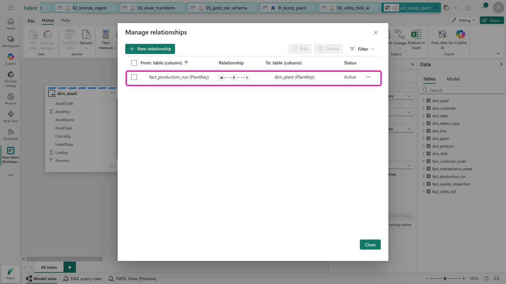

### Task C: The other 19 relationships, with Copilot

8. Close the dialog. On the ribbon click **Copilot**, then paste **Prompt 1** from
   [`assets/copilot-prompts.md`](assets/copilot-prompts.md) and press Enter.

   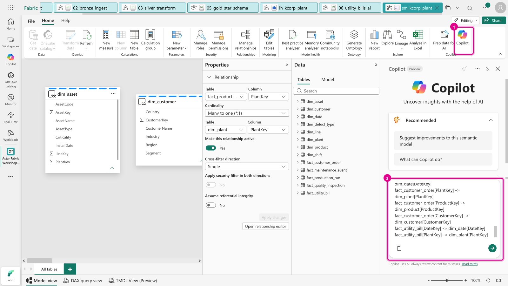

9. The first time, Copilot asks **"Allow Copilot to make changes during this chat session?"** Click **Allow**.

   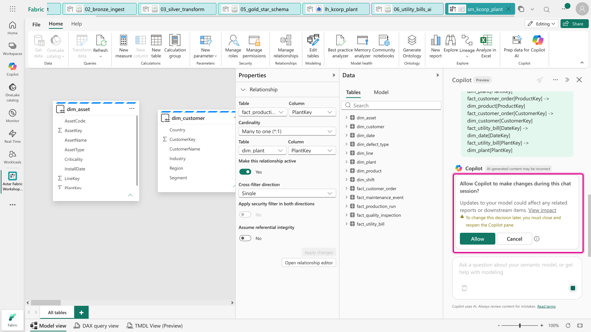

10. After about a minute Copilot lists what it created, and it **left your hand-made relationship alone**.

    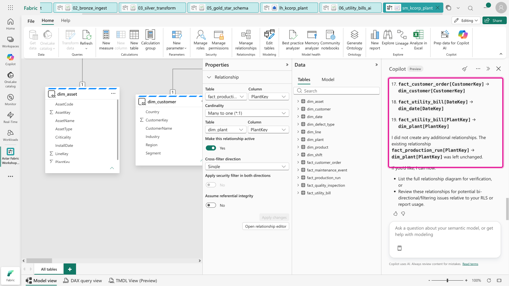

11. **Check its work.** Open **Manage relationships** again. You should see **20 rows**, every one \*:1 (the
    `* ─ 1` icon) and **Active**.

    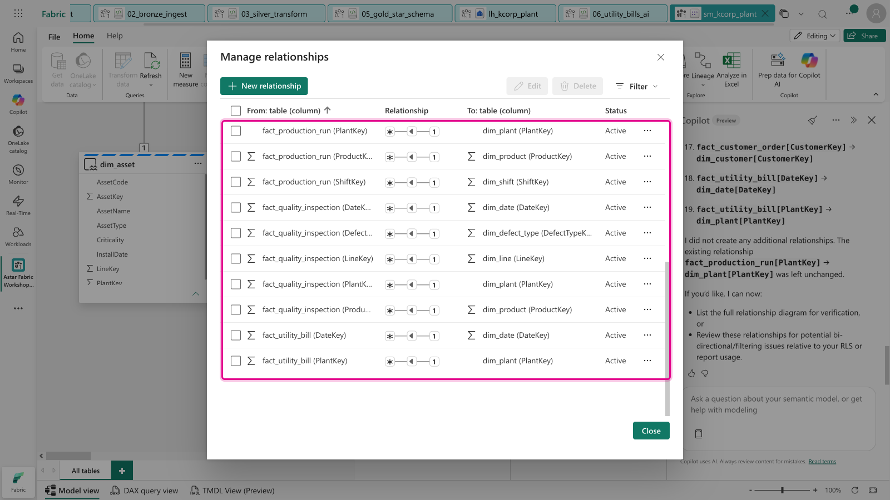

    > ⚠️ **Copilot isn't deterministic.** If a row is missing, or points the wrong way (1 → \*), fix it by hand as
    > in Task B, or run the catch-up notebook, which adds only what's missing and flags reversed relationships.

### Task D: Measures, the first two by hand, then Copilot

12. In the **Data** pane click the **`fact_production_run`** table (so the measure lands there), then **New measure**
    on the ribbon. Replace the text in the formula bar with the line below, and click the **✓**:

    ```dax
    [Actual Units] = SUM ( 'fact_production_run'[ActualUnits] )
    ```

    ![The formula bar with [Actual Units] = SUM(...) and the check mark highlighted.](../docs/images/lab07/lab07-12-new-measure-formula.png)

    > ⚠️ **Put the measure name in `[brackets]`.** In the web editor, a name with a space must be bracketed.
    > Otherwise you get *"To use special characters in a measure name, enclose the entire name in brackets"*.
    >
    > 

13. The measure appears in the Data pane with a calculator icon, and **Properties** shows its **Home table** and
    **Format**.

    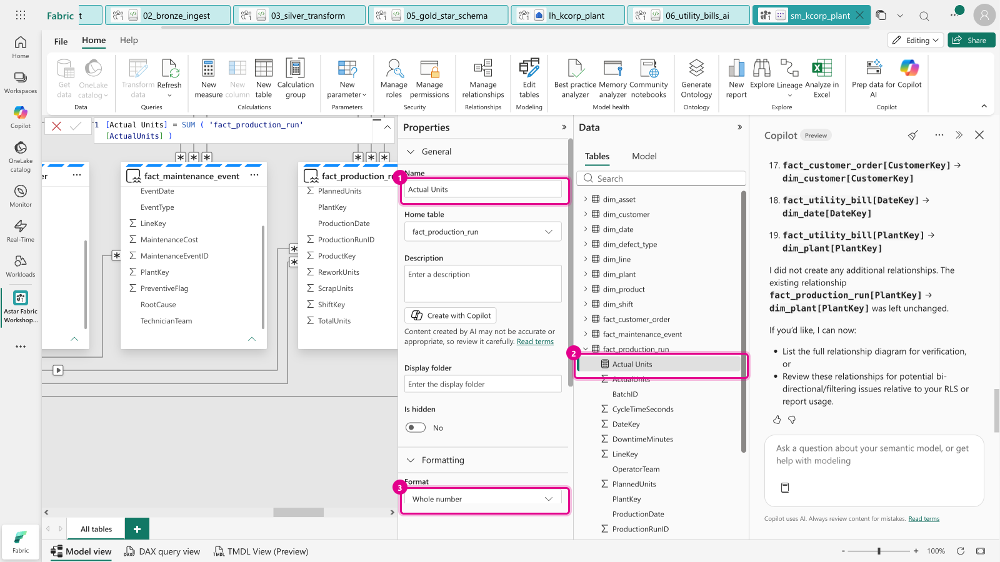

14. Repeat for **`[Planned Units] = SUM ( 'fact_production_run'[PlannedUnits] )`**.

15. In **Copilot**, paste **Prompt 2** from [`assets/copilot-prompts.md`](assets/copilot-prompts.md). It adds the other
    14 measures, each on the right table, with its format string.

    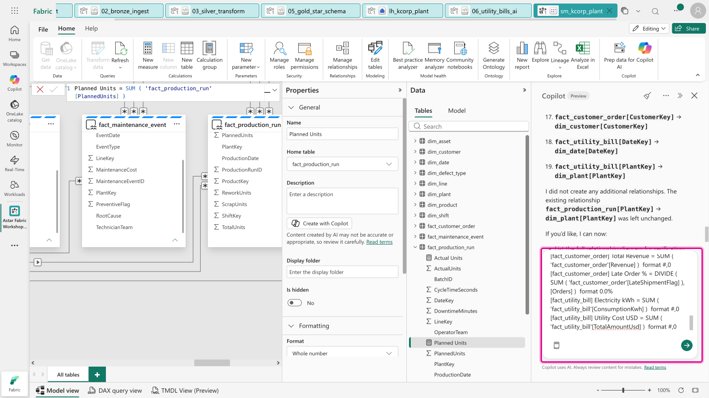

    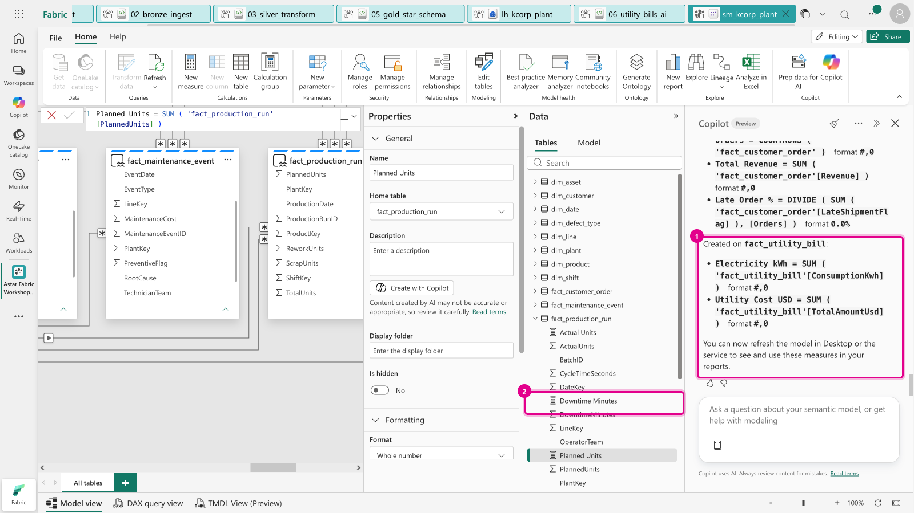

16. Add the last measure by hand. It's too subtle to leave to Copilot: **energy per unit** divides electricity
    (only billed January–June 2026) by the units produced **in the same months**. Click `fact_utility_bill` in the
    Data pane first, then **New measure**:

    ```dax
    [Energy per Unit kWh] =
    VAR BilledMonths = FILTER ( VALUES ( 'dim_date'[YearMonth] ), CALCULATE ( COUNTROWS ( 'fact_utility_bill' ) ) > 0 )
    RETURN DIVIDE ( [Electricity kWh], CALCULATE ( [Actual Units], BilledMonths ) )
    ```

    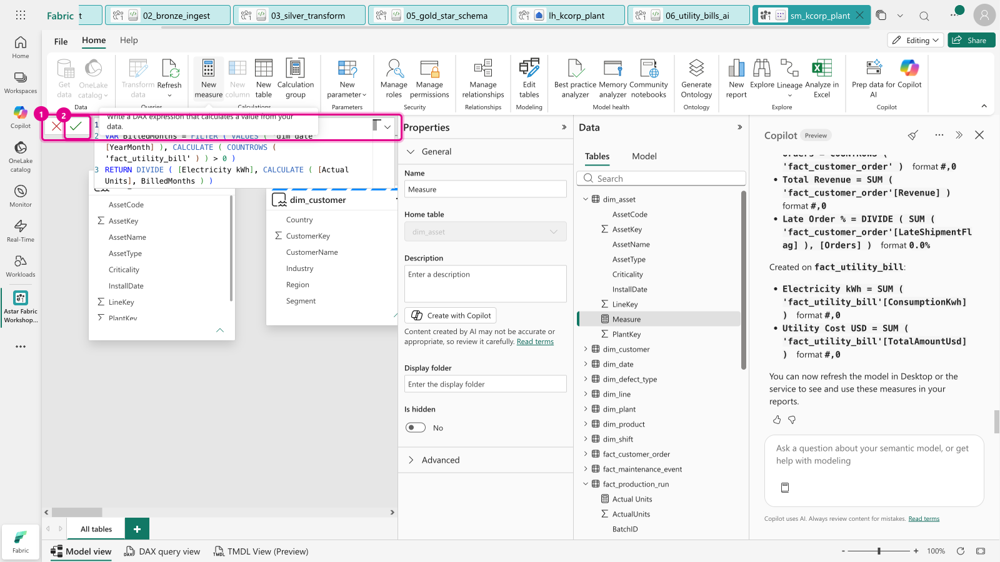

    > If a measure lands on the wrong table, change **Home table** in its **Properties**. Nothing else changes.

### Task E: Check the numbers

17. At the bottom of the screen, switch to **DAX query view**. Paste [`assets/check-measures.dax`](assets/check-measures.dax)
    and click **Run**. (Close the *"Run DAX queries on your model"* welcome pop-up if it appears.)

    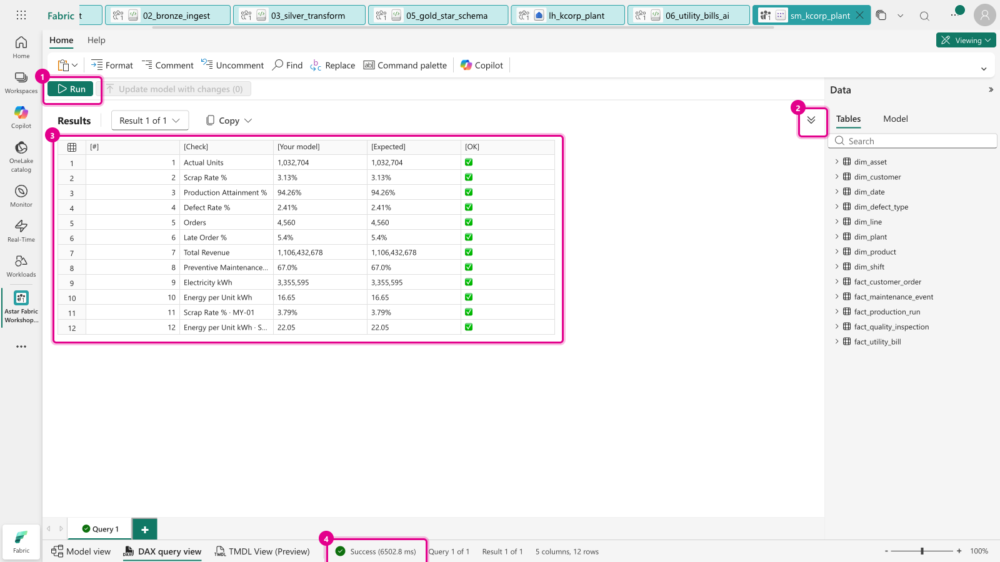

    Click the arrow at the top right of **Results** (**2**) to give the results the full height and see all 12 rows.
    **Every row must show ✅.** The first ten are the headline measures, the same numbers your Gold notebook produced
    in Lab 5. The last two slice a measure **by plant**, which only works if the relationships to `dim_plant` are
    right. A ❌ or a blank *Your model* cell tells you which measure or relationship to fix.
    If the query fails instead, read the error: it names the measure that is missing or spelled differently.

18. Switch back to **Model view**. Zoom out (bottom right) to see all 13 tables joined up.

    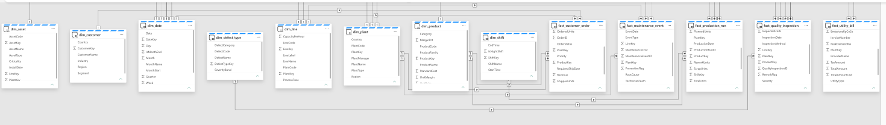

> 🆘 **Behind, or the numbers don't match?** Import and run
> [`07_semantic_model_catchup.ipynb`](notebooks/07_semantic_model_catchup.ipynb). It connects to `sm_kcorp_plant`,
> adds any missing relationships and measures, and checks the headline numbers.

---

### ✅ Checkpoint

| Measure | Expected |
|---|---:|
| Actual Units | **1,032,704** |
| Scrap Rate % | **3.13%** |
| Production Attainment % | **94.26%** |
| Defect Rate % | **2.41%** |
| Orders | **4,560** |
| Late Order % | **5.4%** |
| Total Revenue | **1,106,432,678** |
| Preventive Maintenance % | **67.0%** |
| Electricity kWh | **3,355,595** |
| Energy per Unit kWh | **16.65** (SG-01 22.05 · MY-01 18.28 · AU-01 15.68 · IN-01 11.84) |
| Scrap Rate % for MY-01 | **3.79%** |

### Next up
**[★ Stretch · Let Copilot build the report](../lab08-stretch-report/README.md)**, or you're done. 🎉
