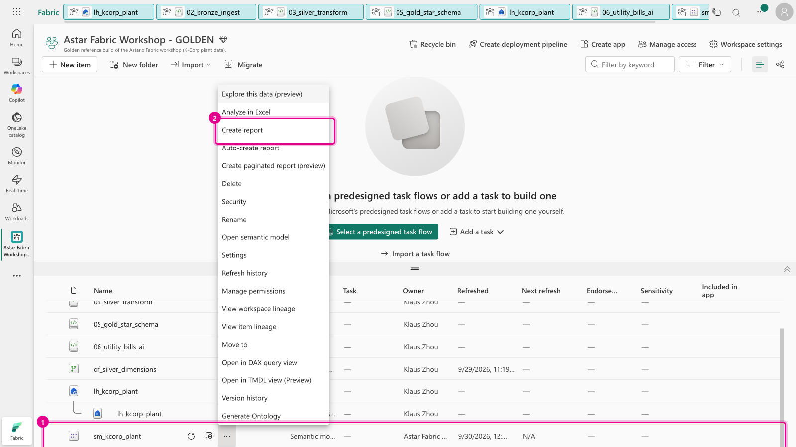
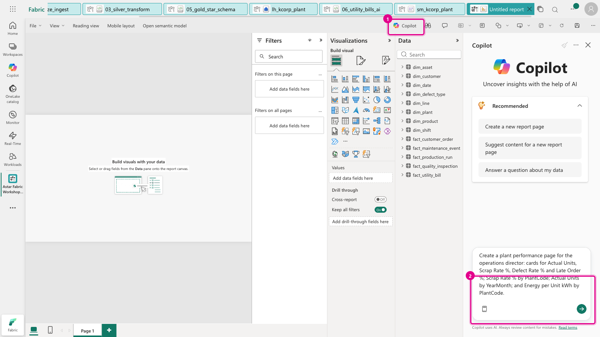
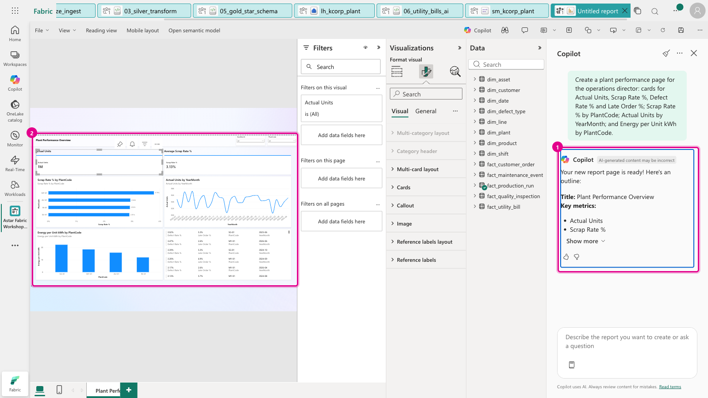
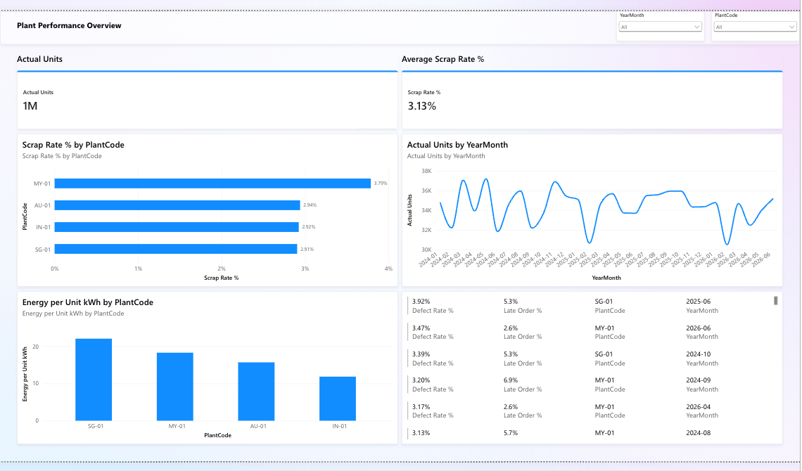
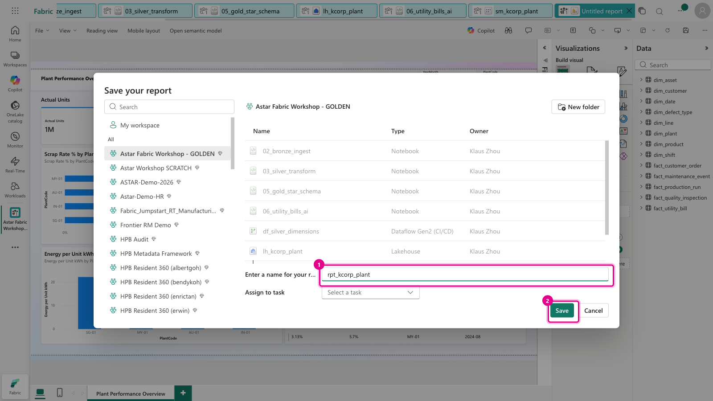

[← Workshop home](../README.md)

# ★ Stretch · Let Copilot build the report

**⏱ 10 min (optional)** · **🎯 Goal:** a one-page Power BI report built by Copilot from your semantic model, with
no manual visual placement.

Your semantic model already knows what *Scrap Rate %* and *Energy per Unit kWh* mean, so Copilot can build
sensible visuals from a plain-English description.

> **Needs:** Copilot enabled on the capacity (see the [pre-flight](../docs/facilitator/preflight-checklist.md)), and a
> Power BI Pro or PPU licence to save a report in a shared workspace.

> ▶ **Watch it:** [Copilot building the report page](../docs/media/lab08-copilot-report.mp4) (short screen recording from the golden run)

### Task A: Create a report from the model

1. In your workspace, hover **`sm_kcorp_plant`** → **⋯ (More options)** → **Create report**.

   

### Task B: Describe the page you want

2. Click **Copilot** on the report toolbar. In the box at the bottom of the pane, type (or paste):

   ```text
   Create a plant performance page for the operations director: cards for Actual Units, Scrap Rate %,
   Defect Rate % and Late Order %; Scrap Rate % by PlantCode; Actual Units by YearMonth; and
   Energy per Unit kWh by PlantCode.
   ```

   

   > 💡 Being specific pays off: name the **measures** and the **fields** exactly as they appear in the Data pane.
   > *"Suggest content for a new report page"* also works, but you get Copilot's choice of visuals.

3. After 30–60 seconds, Copilot builds the page and summarises what it did.

   

   Collapse the side panes to see it properly. **MY-01**'s scrap rate and **SG-01**'s energy per unit stand out,
   the same stories you found in Labs 5 and 6:

   

   > Copilot's layout varies from run to run. **Check every number against the Lab 7 checkpoint.** A report
   > is only as trustworthy as the model underneath it.

### Task C: Save it

4. Click **Save** (the disk icon, top right) and name the report **`rpt_kcorp_plant`**.

   

### Try next

- Click a bar in *Scrap Rate % by PlantCode*: every other visual filters to that plant.
- Ask Copilot a question instead of building a page: *"Which plant has the highest scrap rate, and how does its
  energy per unit compare?"*
- See Direct Lake at work: in any notebook attached to `lh_kcorp_plant`, run
  `spark.sql("DELETE FROM gold.fact_production_run WHERE PlantKey = 4")`, then click **Refresh** on the report.
  AU-01 disappears from the visuals, with no import and no scheduled refresh. Re-run the **Lab 5** notebook to put it back.

### ✅ Done

You've taken raw CSVs and scanned PDFs all the way to a Copilot-built report, in one Lakehouse, with every number
checked. 🎉

**Next:** [★ Lab 9 · Talk to your data with a data agent](../lab09-data-agent/README.md), or
**[← back to the workshop home](../README.md)**
