[← Workshop home](../README.md)

# ★ Lab 9 · Talk to your data: a Fabric data agent

**⏱ 25 min (optional: fast finishers and take-home)** · **🎯 Goal:** a published **data agent**,
`agent_kcorp_plant`, that answers plain-English questions about K-Corp's plants from your semantic model, with
answers you've checked against the Lab 7 numbers.

### What you'll build

A **Fabric data agent** is a chat assistant over your own data. A colleague asks *"Which plant uses the most energy
per unit?"*. The agent turns that into a **DAX query**, runs it against `sm_kcorp_plant` **as that user**, and
replies with the answer and the query it used.

The lab also shows the most important lesson about AI on data: **the agent is only as good as the semantic model
behind it.** You'll watch the agent make a reasonable but wrong assumption, then fix it in the model, not in the
agent.

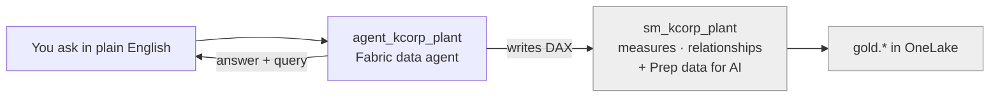
```mermaid
flowchart LR
  U["You ask in plain English"] --> A["agent_kcorp_plant<br/>Fabric data agent"]
  A -->|"writes DAX"| SM["sm_kcorp_plant<br/>measures · relationships<br/>+ Prep data for AI"]
  SM --> G["gold.* in OneLake"]
  A -->|"answer + query"| U
  classDef done fill:#eeeeee,stroke:#999999,color:#333333;
  class SM,G done;
```

> **Needs:** Lab 7 finished (`sm_kcorp_plant` with its measures, checked with ✅), a paid F2+ capacity, and the
> Copilot / Azure OpenAI tenant settings (see the [pre-flight](../docs/facilitator/preflight-checklist.md)). You
> need **Write** permission on the model for Task D. You have it, because you built it.

### Files
- [`assets/ai-instructions.txt`](assets/ai-instructions.txt): AI instructions for the semantic model (Task D)
- [`assets/agent-instructions.txt`](assets/agent-instructions.txt): instructions for the agent itself (Task E)
- [`assets/agent-description.txt`](assets/agent-description.txt): the description you publish with (Task F)
- [`assets/questions.md`](assets/questions.md): questions to try, with the correct answers

---

### Task A: Create the agent

1. In your workspace, click **+ New item**, type `data agent` in the filter box and choose **Data agent**.

   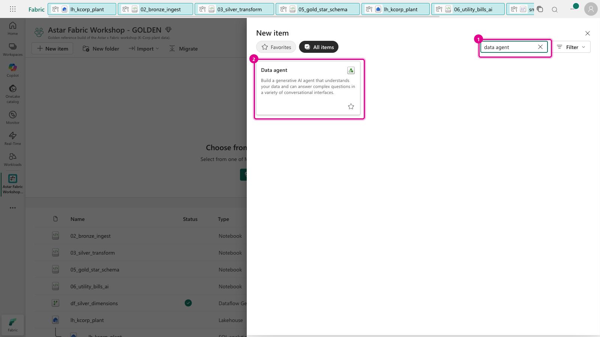

2. Name it **`agent_kcorp_plant`** and click **Create**.

   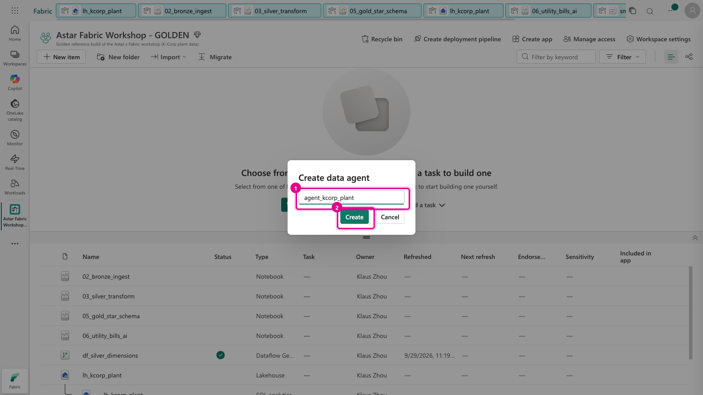

3. A short welcome tour opens. Click **Skip**.

   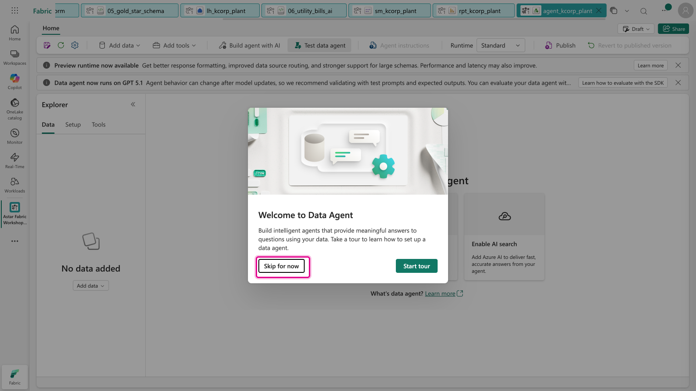

### Task B: Connect it to your semantic model

4. Click **Add a data source**.

   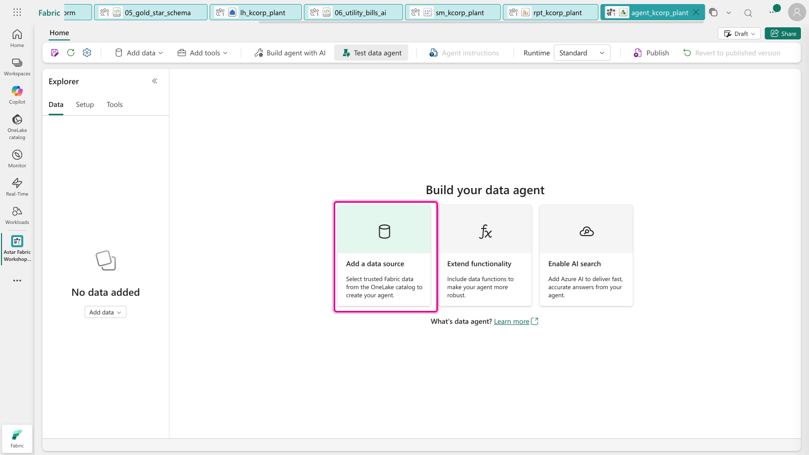

5. In the OneLake catalog, type `sm_kcorp_plant` in the **Filter** box, select **your** semantic model, and click
   **Add**.

   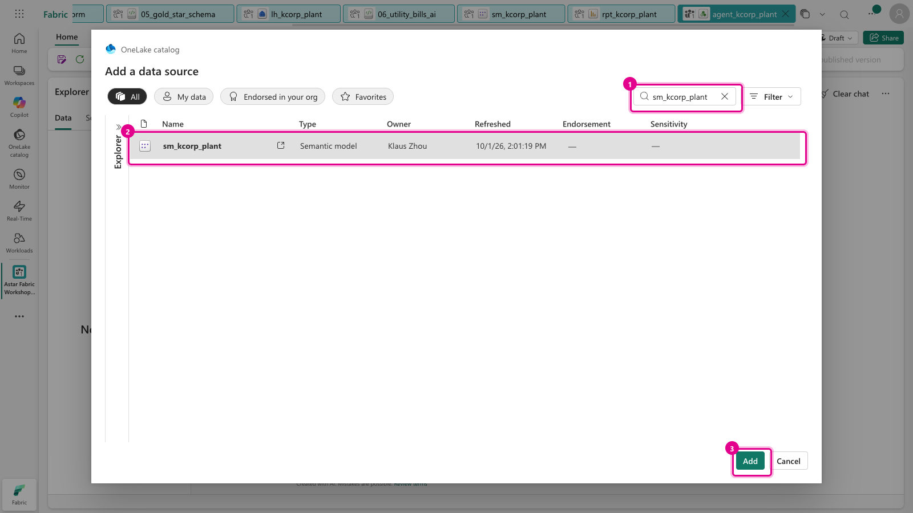

   > 💡 Make sure you pick the **semantic model** (the grid icon), not the lakehouse. The agent can use either,
   > but only the model knows what *Scrap Rate %* means.

6. In the **Explorer** on the left, expand `sm_kcorp_plant` and tick the model, which ticks all 13 tables.
   A pop-up warns that the **Standard runtime supports up to 25 tables**. We have 13, so click
   **Continue with Standard**. (The steps here were tested on Standard; you can switch runtime later.)

   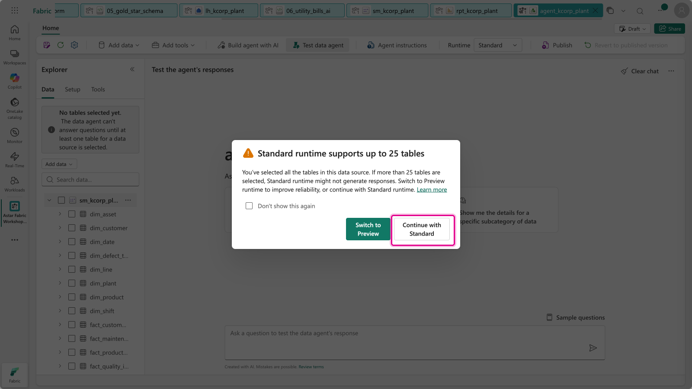

7. Check that `sm_kcorp_plant` and its 13 tables are ticked. The agent can only see ticked tables.

   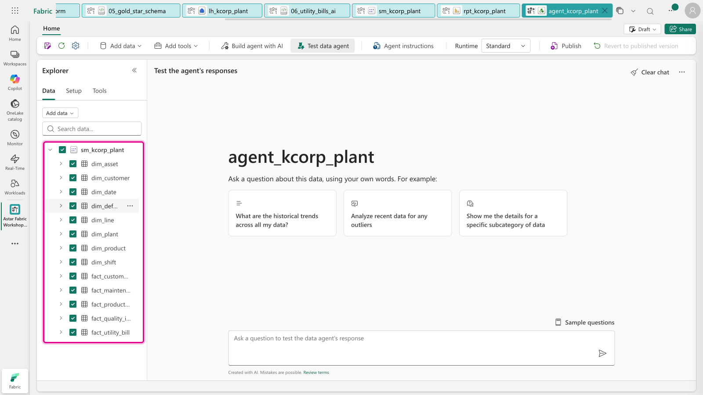

### Task C: Ask, and check the answer

8. In the box at the bottom, ask:

   ```text
   What is the scrap rate for each plant?
   ```

   Wait 20–40 seconds. Now compare the answer with your **Lab 7 checkpoint**, where MY-01 was **3.79%**.

   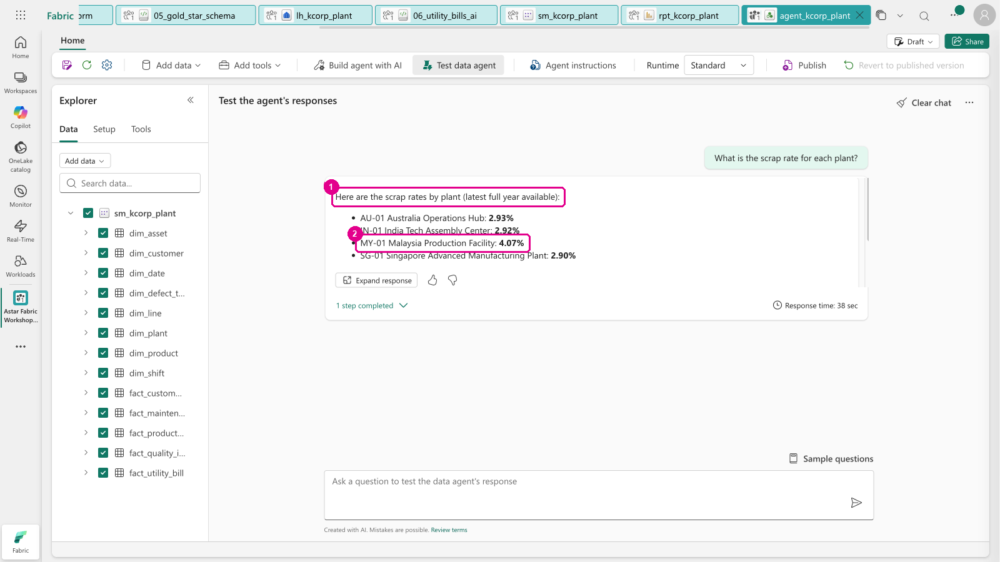

   In the golden run, the agent quietly answered for **"the latest full year"** (2025), so MY-01 showed
   **4.07%**, not 3.79%. Nobody asked for that filter. Your agent may or may not do the same; AI answers vary
   from run to run. Either way, read on: *how* do you find out what it did?

9. Click **1 step completed** to open the agent's working. The first line is the question the agent **actually
   asked the model**: it rewrote yours and added *"using the latest available full year"*.

   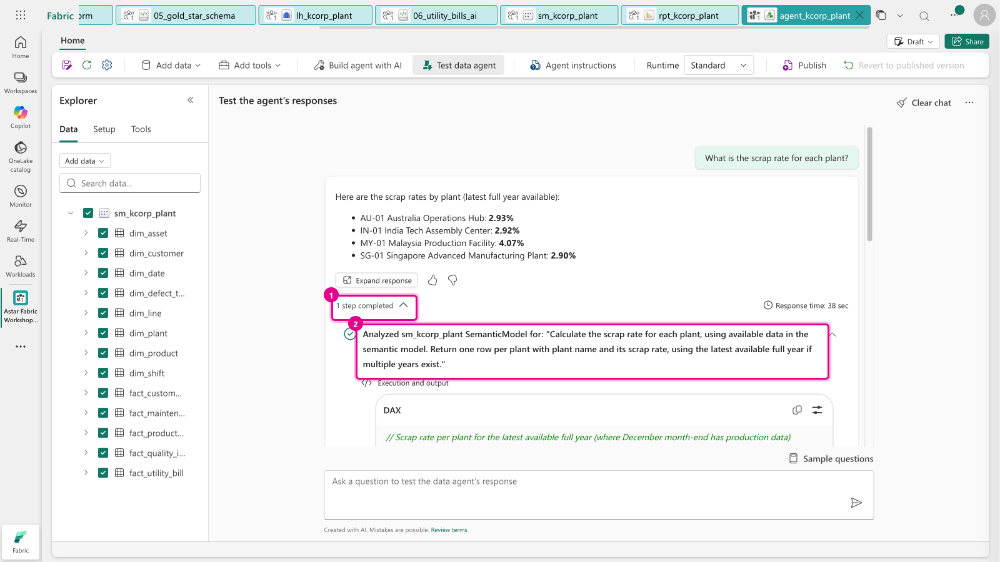

10. Scroll down to **DAX**: this is the exact query it ran. The comment says it all: *scrap rate per plant for the
    latest available full year*.

    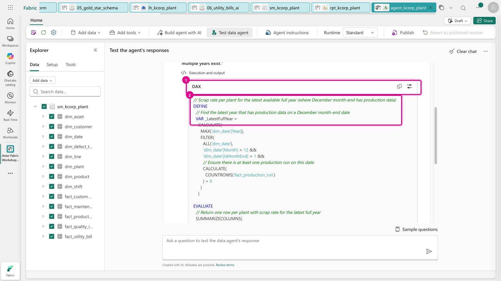

    > 🔎 **Always check the query, not just the answer.** The number looked plausible, and it was correctly
    > calculated, but for a period you didn't ask about. This is the single most common way AI answers go wrong.

11. Click **Clear chat** (top right) → **Clear chat**, then try a word the model doesn't define:

    ```text
    Which plant has the best yield?
    ```

    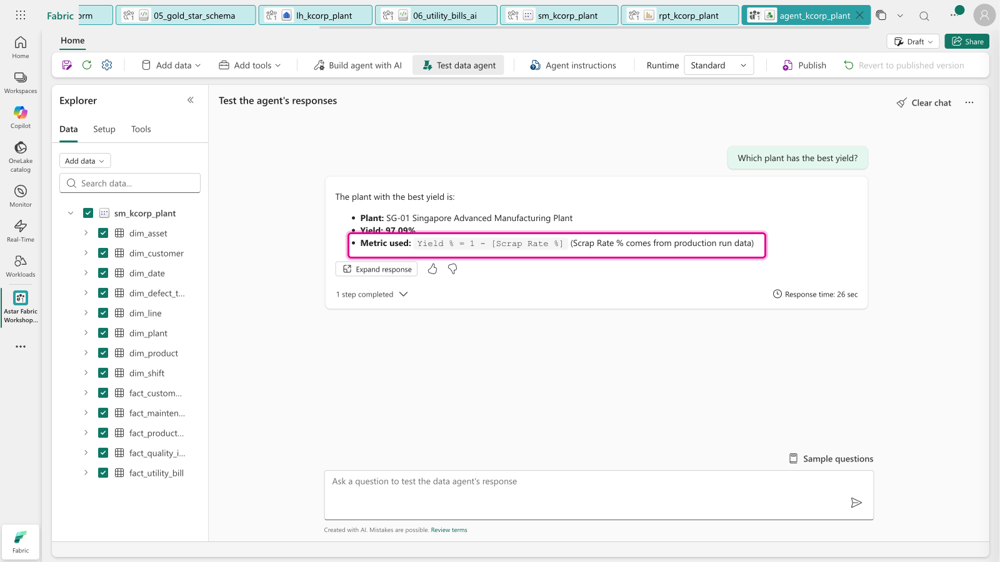

    There's no *yield* measure in the model, so the agent **made one up** (`1 − Scrap Rate %`). This time the guess
    was sensible, but it's still a guess. In Task D you'll replace the guesswork with a definition everyone agrees on.

### Task D: Teach the *model*, not the agent

> 🧠 **Key idea.** When the agent queries a **semantic model**, the part that writes DAX reads only the **model's**
> metadata and its **Prep data for AI** settings. **It ignores the agent's own instructions.** So business
> definitions such as *yield* or *"no period means all data"* belong **in the model**, where Copilot in Power BI
> and every other agent will use them too.

12. Open **`sm_kcorp_plant`** from your workspace. If the top right says **Viewing**, switch it to **Editing**
    (as in Lab 7). On the **Home** ribbon, click **Prep data for AI**.

    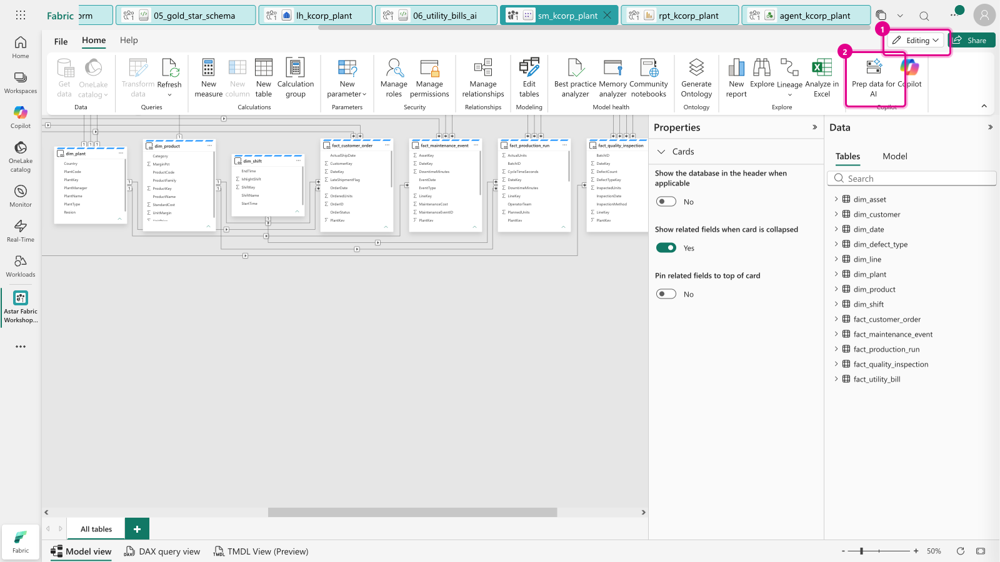

13. The dialog has three tools. You'll use **Simplify the data schema** and **Add AI instructions**.
    (*Verified answers* need a report visual; try them after the ★ report lab.)

    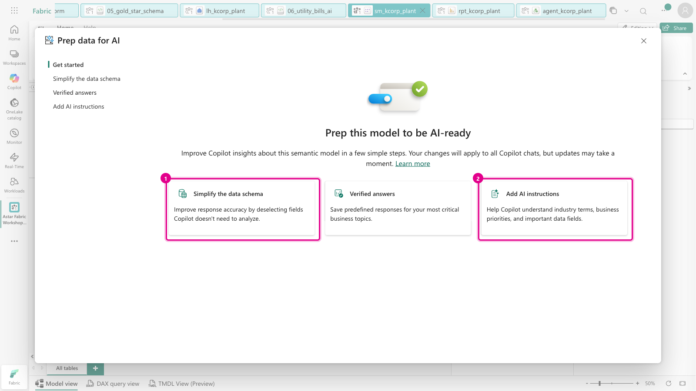

14. **Simplify the data schema.** Click it in the left menu and wait for the tables to load (up to a minute).
    Expand **`fact_production_run`**. You'll see a measure and a raw column with nearly the same name, for example
    **Actual Units** (a measure, calculator icon) and **ActualUnits** (a column, Σ). Untick the **columns**
    **`ActualUnits`**, **`DowntimeMinutes`**, **`PlannedUnits`** and **`ScrapUnits`**, so the AI uses the agreed
    measures. Click **Apply**.

    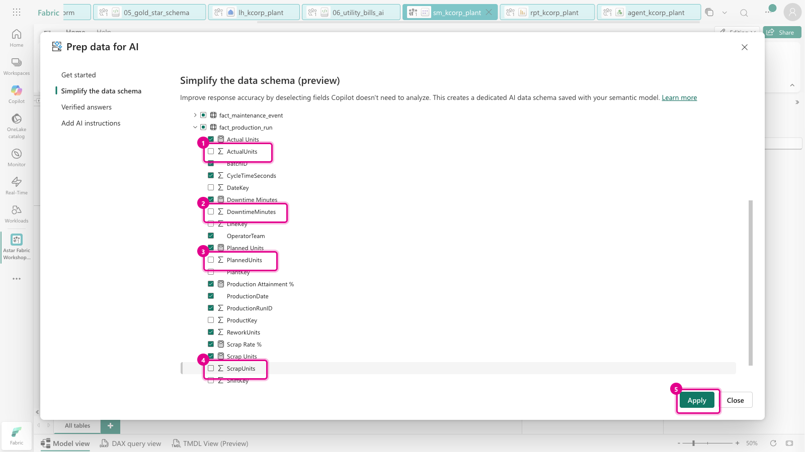

    > 💡 The key columns (`DateKey`, `PlantKey`, …) are already unticked: Fabric hides technical keys from the AI
    > by default.

15. **Add a Yield % measure.** Close the dialog. In the **Data** pane, select **`fact_production_run`**, click
    **New measure**, paste this into the formula bar and press the ✔:

    ```dax
    Yield % = IF ( NOT ISBLANK ( [Scrap Rate %] ), 1 - [Scrap Rate %] )
    ```

    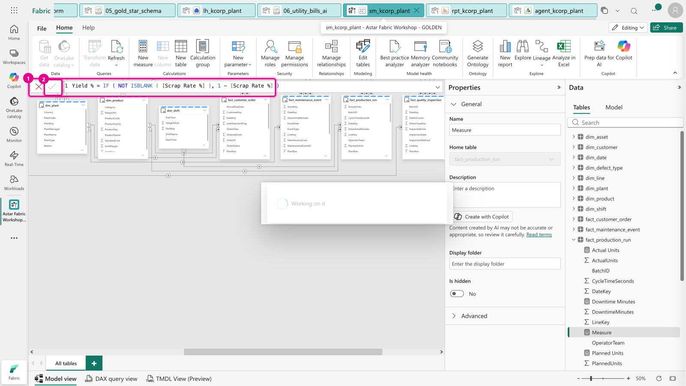

    In **Properties → Formatting**, set **Format** to **Percentage**. The `IF ( NOT ISBLANK … )` matters: without
    it, rows with no data get a yield of **100%**. You'll see why in the checkpoint.

16. Open **Prep data for AI** again → **Add AI instructions**. Paste the whole of
    [`assets/ai-instructions.txt`](assets/ai-instructions.txt) and click **Apply**.

    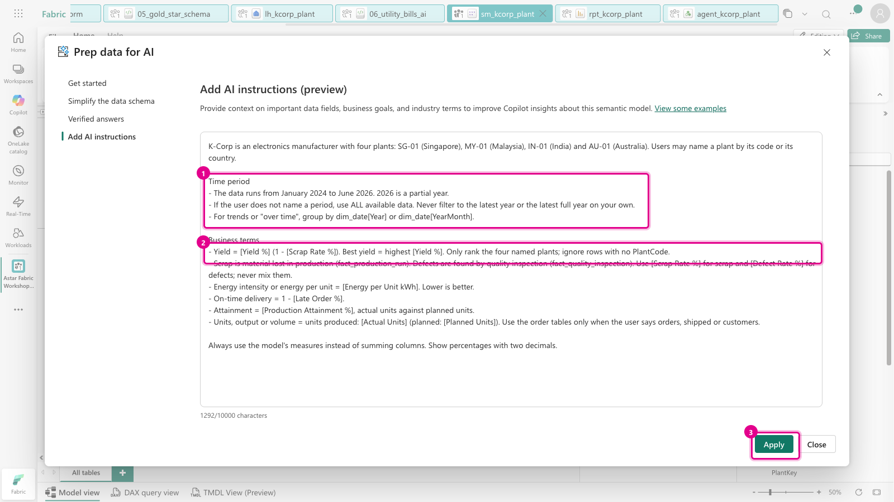

    Read what you pasted. Three rules fix what you'll see go wrong in this lab:
    - **Time period:** *if the user does not name a period, use ALL available data*;
    - **Yield** points at the new `[Yield %]` measure and says to rank only the four named plants;
    - **Units** means units *produced*, not units *ordered* (see the checkpoint).

    > ⏳ Changes can take a few minutes to reach the agent. If an answer looks unchanged, wait a minute and ask
    > again.

17. Back in **`agent_kcorp_plant`**, **Clear chat** and ask the first question again:

    ```text
    What is the scrap rate for each plant?
    ```

    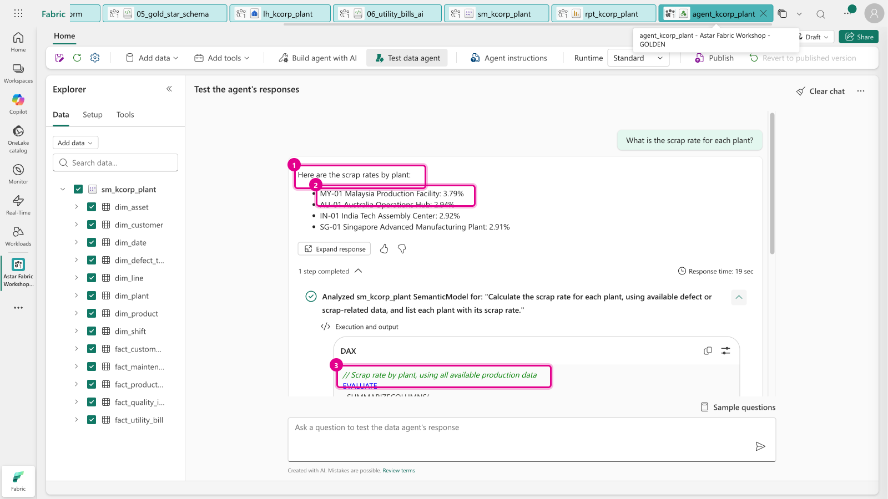

    Now the numbers match Lab 7 exactly: **MY-01 3.79%**, AU-01 2.94%, IN-01 2.92%, SG-01 2.91%. The DAX comment
    says *using all available production data*.

18. **Clear chat** and ask about yield again, this time with a comparison:

    ```text
    Which plant has the best yield, and how does MY-01 compare?
    ```

    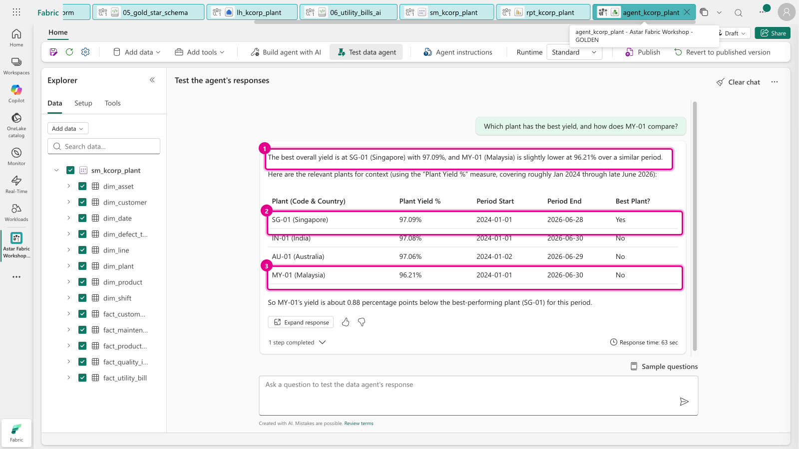

    It now uses your **Yield %** measure: **SG-01 97.09%** is best and **MY-01 96.21%** is the lowest.

### Task E: Agent instructions: tone and format only

19. Click **Agent instructions** on the ribbon. Replace the placeholder text with the contents of
    [`assets/agent-instructions.txt`](assets/agent-instructions.txt). It saves automatically.

    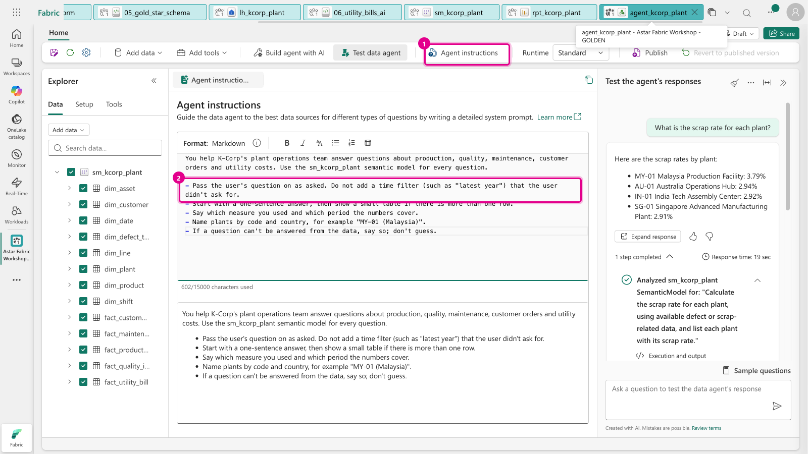

    These rules shape **how the agent answers** (lead with one sentence, say which measure and period, name plants
    by code and country), and stop it adding filters when it hands your question to the model. They are *not* the
    place for business definitions; those live in the model (Task D).

20. Ask:

    ```text
    Which plant uses the most energy per unit produced?
    ```

    Click **Expand response** to see the whole table.

    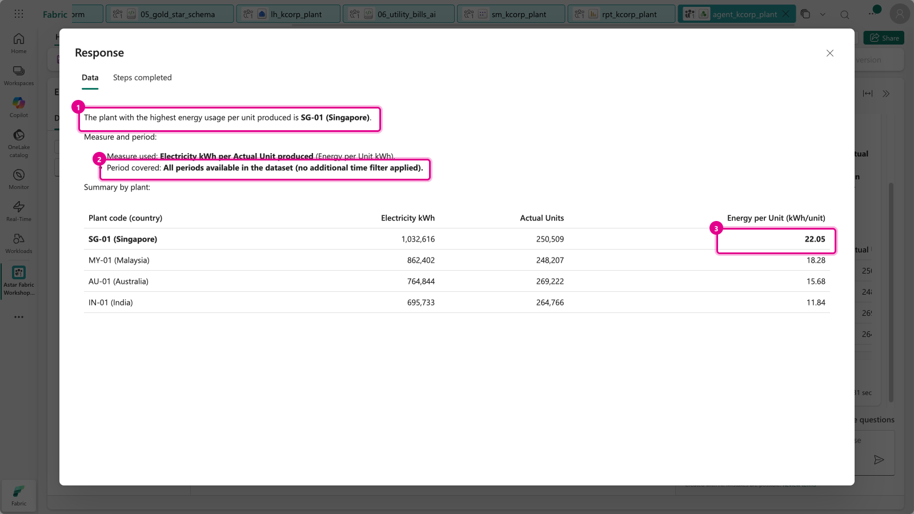

    **SG-01 at 22.05 kWh/unit**: the same number as your Lab 6 *payoff* cell and your Lab 7 check. Three
    different tools, one number, because they all use the same Gold data and the same measure.

### Task F: Publish it

21. Click **Publish**. Paste [`assets/agent-description.txt`](assets/agent-description.txt) into
    **Description of purpose and capabilities** and click **Publish**. Leave *Also publish to Microsoft 365 Copilot*
    **Off** for today.

    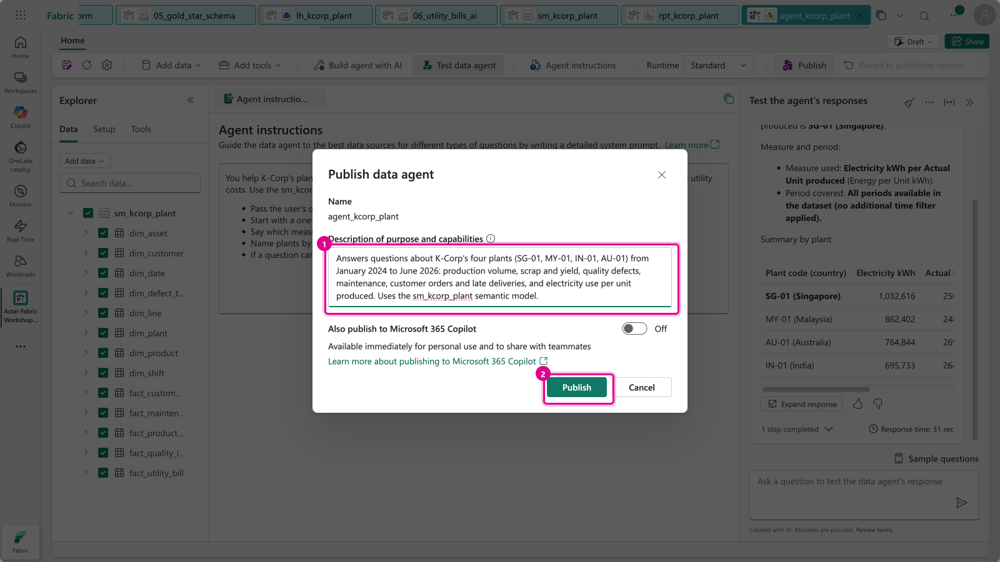

    > 💡 The description isn't just for people. When other AI tools (Microsoft 365 Copilot, Copilot Studio,
    > Microsoft Foundry) are given several agents, they use the description to decide **which agent to ask**.

22. Switch the top-right selector from **Draft** to **Published**. This is what colleagues see: your description
    and a chat box, with no editing tools. Keep improving the **Draft**; nothing changes for users until you
    **Publish** again.

    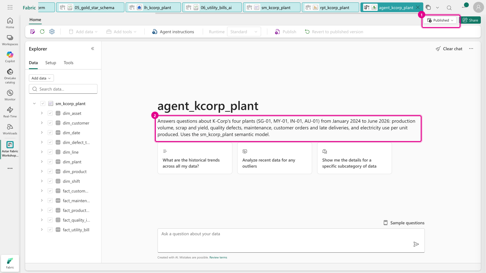

    > 💡 Changed something in the **model** (a measure, Prep data for AI)? The agent's Draft sees it straight away,
    > but click **Publish** again (*Publish changes*) so colleagues on the Published version get it too.

---

### ✅ Checkpoint

Ask your agent these questions (in Draft or Published) and check the numbers. The wording will differ from run
to run; **the numbers must not**. More questions are in [`assets/questions.md`](assets/questions.md).

| Ask | Expected |
|---|---|
| What is the scrap rate for each plant? | MY-01 **3.79%** · AU-01 **2.94%** · IN-01 **2.92%** · SG-01 **2.91%** |
| Which plant uses the most energy per unit produced? | **SG-01** at **22.05** kWh/unit (MY-01 18.28 · AU-01 15.68 · IN-01 11.84) |
| Which plant has the best yield, and how does MY-01 compare? | **SG-01 97.09%** (IN-01 97.08%, AU-01 97.06%); MY-01 **96.21%**, the lowest |
| How many units did our plants produce in 2025? | **415,260** (AU-01 112,917 · IN-01 105,733 · MY-01 101,753 · SG-01 94,857) |

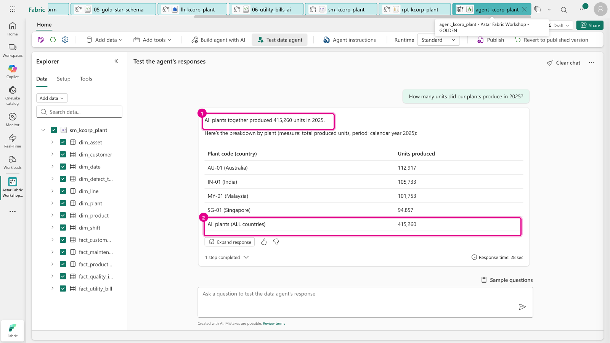

> ⚠️ **Words matter.** In the golden run, *"What were total **actual** units in 2025?"* got **474,693**, then
> **497,238**: the agent summed **ordered** units from `fact_customer_order`, probably led by the column
> `ActualShipDate`. It said so in *Measure used*, so the evidence was on screen. *"How many units did our plants
> **produce**…"* got the right answer every time. The AI instruction *"Units … = units produced"* helps but doesn't
> guarantee it, so **read the measure line**.
>
> 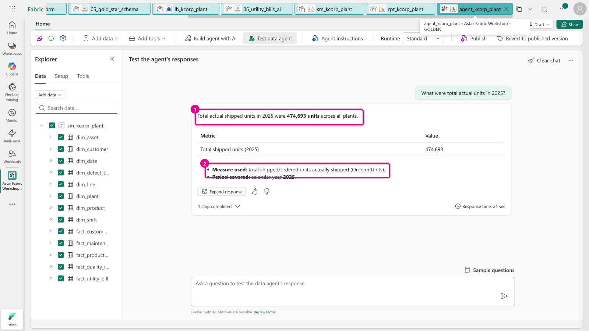

> ⚠️ **Watch for the blank row.** Before the `Yield %` measure existed, the golden agent answered the yield question
> with an **unnamed plant at 100%** on top. That was the model's empty "no plant" row, where `1 − blank` = 1. If you
> see that, check that you created `Yield %` with the `IF ( NOT ISBLANK … )` guard.
>
> 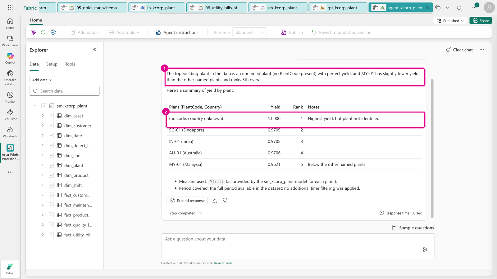

### Discuss with your neighbour

- The agent's first scrap answer was **correctly calculated** but for the **wrong period**. How would a manager
  reading only the chat have known?
- Why do definitions like *yield* belong in the **semantic model** rather than in the agent's instructions? Who else
  benefits?
- Which K-Corp questions would you **not** trust a data agent with yet? (Hint: *"why did scrap rise?"* needs
  reasoning, not a query.)

### What went wrong?

| Symptom | Fix |
|---|---|
| **Data agent** isn't in *New item* | The Copilot / Azure OpenAI tenant settings are off, or the workspace isn't on a paid F2+ capacity. Ask your facilitator. |
| The agent says it can't access the data | You picked the lakehouse or someone else's model. Remove the source (**⋯ → Remove**) and add **your** `sm_kcorp_plant`. |
| **Prep data for AI** is greyed out | The model is in **Viewing** mode. Switch to **Editing** (top right). |
| Answers ignore your AI instructions | Wait a few minutes, then **Clear chat** and ask again. If still unchanged, in the agent's Explorer hover the model → **⋯ → Refresh**. |
| Numbers differ from the checkpoint | Open **steps → DAX**. Look for a filter you didn't ask for (a year, a plant) or a measure you didn't expect. |

### Next up

You're done. 🎉 To go further, see
[Semantic model best practices for data agents](https://learn.microsoft.com/fabric/data-science/semantic-model-best-practices)
and [Consume a data agent from Microsoft Copilot Studio](https://learn.microsoft.com/fabric/data-science/data-agent-microsoft-copilot-studio-tool).
